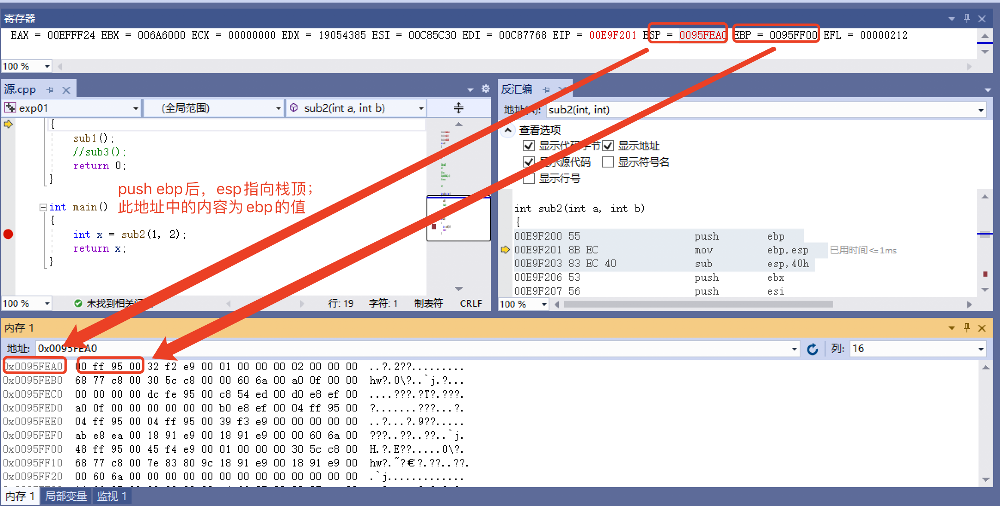

## 逆向工程实验一
>注：由于本实验结果是经过观察多次反汇编过程后逐步得出的，故对于相同函数的调用，以下截图中显示的地址可能不完全相同，但本质是不变的。
### 实验步骤
#### 1、在vs中建立工程，修改编译选项，只保留/ZI（调试）和pdb文件路径两个选项。增加禁用安全检查选项（/GS-）

#### 2、编译多个函数调用的示例代码。

```c
#include <Windows.h>
#include <stdio.h>
#include <stdlib.h>
int sub1()
{
	int a = 0;
	return 0;
}


int sub2(int a, int b)
{

	return 0;
}

int main()
{
	int x = sub2(1, 2);
	return x;
}
```

#### 3、下断点调试运行，观察反汇编、寄存器、内存等几个调试时的信息。
##### 在 main函数sub2处下断点

1.  main调用`sub2` 的反汇编过程
   
```asm
;进入该函数时各个寄存器的值：
EAX = 0117FF24 EBX = 00EED000 ECX = 00000000 EDX = 00000000 ESI = 01495770 EDI = 01495530 EIP = 0111F209 ESP = 00DCFA00 EBP = 00DCFA50 EFL = 00000216 

  	int x = sub2(1, 2);
0111F209 6A 02                push        2  ;先将参数2压入栈中
0111F20B 6A 01                push        1  ;再将参数1压入栈中
0111F20D E8 91 C8 FF FF       call        0111BAA3  ;调用sub2,见图2.1
0111F212 83 C4 08             add         esp,8  
0111F215 89 45 FC             mov         dword ptr [ebp-4],eax  
```


2.  `sub2` 的反汇编过程

```asm
;进入该函数时各个寄存器的值：
EAX = 0117FF24 EBX = 00EED000 ECX = 00000000 EDX = 00000000 ESI = 01495770 EDI = 01495530 EIP = 0111F530 ESP = 00DCF9F4 EBP = 00DCFA50 EFL = 00000216

  	int sub2(int a, int b)
{
0111F530 55                   push        ebp  ; 在函数开始的时候将ebp压入栈中
0111F531 8B EC                mov         ebp,esp  ;将esp的值赋给ebp：ESP = 00B1F90C EBP = 00B1F90C 
00C1DF03 83 EC 44
0111F533 83 EC 40             sub         esp,40h  
0111F536 53                   push        ebx  
0111F537 56                   push        esi  
0111F538 57                   push        edi  ; ebx、esi和edi压栈，esp = esp - 4*3 
	sub1();
0111F539 E8 DA A5 FF FF       call        01119B18  ;准备调用sub_function1，见图2.4
```
- 执行push ebp后，内存的变化如下


3. 跳出sub2进入sub1

```asm
int sub2(int a, int b)
{
0111F530 55                   push        ebp  
0111F531 8B EC                mov         ebp,esp  
0111F533 83 EC 40             sub         esp,40h  
0111F536 53                   push        ebx  
0111F537 56                   push        esi  
0111F538 57                   push        edi  
	sub1();
0111F539 E8 DA A5 FF FF       call        01119B18  
	//sub3();
	return 0;
0111F53E 33 C0                xor         eax,eax  
}
0111F540 5F                   pop         edi  
0111F541 5E                   pop         esi  
0111F542 5B                   pop         ebx  
0111F543 8B E5                mov         esp,ebp  
0111F545 5D                   pop         ebp  
0111F546 C3                   ret  
```
- 准备调用sub1


4.  `sub1` 的反汇编过程

```asm
;进入该函数时各个寄存器的值：
EAX = 0117FF24 EBX = 00EED000 ECX = 00000000 EDX = 00000000 ESI = 01495770 EDI = 01495530 EIP = 0111F240 ESP = 00DCF9A0 EBP = 00DCF9F0 EFL = 00000202 

  	int sub1()
{
0111F240 55                   push        ebp  
0111F241 8B EC                mov         ebp,esp  
0111F243 83 EC 44             sub         esp,44h  
0111F246 53                   push        ebx  
0111F247 56                   push        esi  
0111F248 57                   push        edi  
	int a = 0;
0111F249 C7 45 FC 00 00 00 00 mov         dword ptr [ebp-4],0  
	return 0;
0111F250 33 C0                xor         eax,eax  
}
```
- sub1 return0前内存中的变化:把0移入ebp-4指向的地址

- sub1 return0前内存中的变化：eax与自身异或


5. 返回 `main函数` 的反汇编过程
```asm
int x = sub2(1, 2);
00E9F229 6A 02                push        2  
00E9F22B 6A 01                push        1  
00E9F22D E8 6E AD FF FF       call        00E99FA0  
00E9F232 83 C4 08             add         esp,8  
00E9F235 89 45 FC             mov         dword ptr [ebp-4],eax  
	return x;
00E9F238 8B 45 FC             mov         eax,dword ptr [ebp-4]  
}
00E9F23B 5F                   pop         edi  
00E9F23C 5E                   pop         esi  
00E9F23D 5B                   pop         ebx  
00E9F23E 8B E5                mov         esp,ebp  
00E9F240 5D                   pop         ebp  
00E9F241 C3                   ret  
```
- 完成push1操作后内存的变化

- 准备寻找返回值


#### 4、分析函数调用过程中，栈的变化，解释什么是栈帧？ebp寄存器在函数调用过程中的变化，以及作用。
接下来对涉及函数操作栈和ebp、寄存器的部分进行查看：

1. 进入main函数
- push ebp：保存父栈的栈底
- 将esp赋值给ebp：作当前函数新的栈底

- esp移动，开辟栈帧，即过程活动记录，是编译器用来实现过程/函数调用的一种数据结构。

 
```asm
0090DF20 55                   push        ebp  
0090DF21 8B EC                mov         ebp,esp  
0090DF23 83 EC 44             sub         esp,44h
```

2. 调用sub2函数
- push ebp：保存main函数的栈底
- 将esp赋值给ebp：作当前函数sub2新的栈底

```asm
00E9F200 55                   push        ebp  
00E9F201 8B EC                mov         ebp,esp  
00E9F203 83 EC 40             sub         esp,40h 
```

- 准备跳出sub2进入sub1，要对栈帧进行销毁
- pop 是弹出的意思，弹出后将值给寄存器；先将edi,esi,ebx三个寄存器出栈，然后根据记录的call指令的下一条指令的地址找到父函数，回收空间，完成整个函数调用的过程。
```
0111F540 5F                   pop         edi  
0111F541 5E                   pop         esi  
0111F542 5B                   pop         ebx  
0111F543 8B E5                mov         esp,ebp  
0111F545 5D                   pop         ebp  
```

3. 调用sub1函数
- push ebp：保存sub2函数的栈底
- 将esp赋值给ebp：作当前函数sub1新的栈底
```asm
0111F240 55                   push        ebp  
0111F241 8B EC                mov         ebp,esp  
0111F243 83 EC 44             sub         esp,44h  
```

#### 5、函数局部变量和参数的保存位置、访问方式是什么。
- 函数的局部变量和参数保存位置：栈帧中
- 访问方式：通过访问相对于ebp的偏移

#### 6、多层的函数调用，栈的变化情况，解释未赋初始值的局部变量的值是如何形成的。

- 函数调用和返回过程中的存在如下规则：
  1. 參数压栈传递，而且是从右向左依次压栈。
  2. ebp总是指向当前栈帧的栈底。
  3. 返回值通过eax寄存器传递。

以下属代码为例

```c
#include <Windows.h>
#include <stdio.h>
#include <stdlib.h>
int sub1()
{
	int a = 3;
	return 0;
}

int sub3()
{
 int s;
 printf("%d", s);
 return s;

 }

int sub2(int a, int b)
{
	sub1();
	sub3();
	return 0;
}

int main()
{
	int x = sub2(1, 2);
	return x;
}
```
- 在sub2中先调用sub1再调用sub3，其中sub3中的局部变量未赋初值，但执行printf后却有值3，且每一次都是3

- sub1中把3存在了**0x00D7FB1C**中

- 进入sub3

- 在sub3中return时，return的值存在**0x00D7FB1C**中，也就是sub1中局部变量a=3

- 上述分析解释了未赋初值的局部变量的值是如何产生的

由于pop操作并不是真正将数据从内存中删除，只是栈指针发生变化，让该数据从栈帧中"消失"。

部分函数的返回值留存在内存中，当未赋初始值的局部变量与其地址恰好重合时，就会造成：**未赋初始值的局部变量有值的情况**,这也意味着栈帧的结构是一样的。


## 附录
### 本实验中重要名词解释
#### 1.寄存器
> eax, ebx, ecx, edx, esi, edi, ebp, esp等都是X86 汇编语言中CPU上的通用寄存器的名称，是32位的寄存器。如果用C语言来解释，可以把这些寄存器当作变量看待
- **EAX**："累加器"(accumulator), 它是很多加法乘法指令的缺省寄存器。
- **EBX**："基地址"(base)寄存器, 在内存寻址时存放基地址。
- **ECX**：计数器(counter), 是重复(REP)前缀指令和LOOP指令的内定计数器。
- **EDX**：总是被用来放整数除法产生的余数。
- **EBP**：基址指针寄存器(extended base pointer)，其内存放着一个指针，该指针永远指向系统栈最上面一个栈帧的底部。最经常被用作高级语言函数调用的框架指针(frame pointer)。
- **ESP**：栈指针寄存器(extended stack pointer)，其内存放着一个指针，该指针永远指向系统栈最上面一个栈帧的栈顶。压入堆栈的数据越多，ESP也就越来越小。在32位平台上，ESP每次减少4字节。
- **EIP**：指令指针。当CPU执行完当前的指令后，从EIP寄存器中读取下一条指令的内存地址，然后继续执行。
- **ESI/EDI**：源/目标索引寄存器"(source/destination index),因为在很多字符串操作指令中, DS:ESI指向源串,而ES:EDI指向目标串

#### 2.栈
> 简单说，Stack 是由于函数运行而临时占用的内存区域
- 栈是一种线性逻辑结构，只支持入栈和出栈操作，遵循后进先出的原则
  - 压栈（入栈）：将对象或者数据压入栈中，更新栈顶指针，使其指向最后入栈的对象或数据。
  - 弹栈（出栈）：返回栈顶指向的对象或数据，并从栈中删除该对象或数据，更新栈顶


#### 3.栈帧
- 帧表示程序的函数调用记录，而栈帧又是记录在栈上面。那就可以说栈帧将栈分割成了N个记录块，但是这些记录块大小不是固定的，因为栈帧不仅保存诸如：函数入参、出参、返回地址和上一个栈帧的栈底指针等信息，还保存了函数内部的自动变量。

- 每一次函数的调用,都会在调用栈(call stack)上维护一个独立的栈帧(stack frame)。每个独立的栈帧一般包括:
	- 函数的返回地址和参数；
	- 临时变量: 包括函数的非静态局部变量以及编译器自动生成的其他临时变量
函数调用的上下文；
	- 栈是从高地址向低地址延伸,一个函数的栈帧用ebp 和 esp 这两个寄存器来划定范围.ebp 指向当前的栈帧的底部,esp 始终指向栈帧的顶部;

#### 4.函数调用

- 函数调用分为以下几步:

	- 参数入栈: 将参数按照调用约定(C 是从右向左)依次压入系统栈中;
	- 返回地址入栈: 将当前代码区调用指令的下一条指令地址压入栈中，供函数返回时继续执行;
	- 代码跳转: 处理器将代码区跳转到被调用函数的入口处;
	- 栈帧调整: 
		1. 将调用者的ebp压栈处理，保存指向栈底的ebp的地址（方便函数返回之后的现场恢复），此时esp指向新的栈顶位置； push ebp 
		2. 将当前栈帧切换到新栈帧(将eps值装入ebp，更新栈帧底部), 这时ebp指向栈顶，而此时栈顶就是old ebp mov ebp, esp 
		3. 给新栈帧分配空间 sub esp, XXX

- 函数返回分为以下几步:

	- 保存被调用函数的返回值到 eax 寄存器中 mov eax, xxx
 	- 恢复 esp 同时回收局部变量空间 mov ebp, esp
	- 将上一个栈帧底部位置恢复到 ebp pop ebp
	- 弹出当前栈顶元素,从栈中取到返回地址,并跳转到该位置 