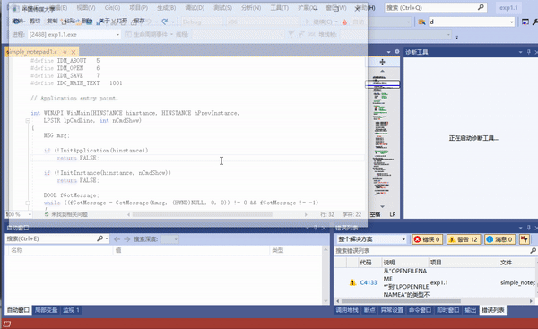
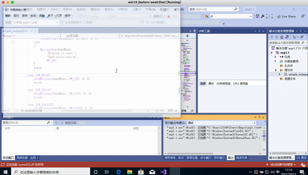

# 逆向工程实验四
## 实验要求
- 熟悉Windows API，在示例代码的基础上增加一个功能：保存和打开文件。
- 提示：使用原生Windows API CreateFile，WriteFile，ReadFile，CloseHandle等。

## 知识储备
- **CreateFile**：这个函数可以创建或打开一个对象的句柄，凭借此句柄就可以控制：控制台对象、通信资源对象、目录对象(只能打开)、磁盘设备对象、文件对象、邮槽对象、管道对象。
- **WriteFile**：可以以同步或异步方式向一个对象句柄中写数据。
- **ReadFile**：这个函数从文件指针指定的位置读取数据。读操作完成后，文件指针将根据实际读出的数据自动进行调整，除非文件句柄是以OVERLAPPED属性值打开的。如果是以OVERLAPPED打开的I/O，应用程序就需要自己手动调整文件指针。这个函数被设计成兼有同步和异步操作。ReadFileEx函数则设计成只支持异步操作，异步操作允许应用程序在读文件期间可以同时进行其他的操作。
- **CloseHandle**：用于关掉一个打开的对象句柄。

## 实验过程
[实验完整脚本](simple_notepad1.c)

- 在`define`和`case`处为新增的「打开文件」和「保存文件」新增对应内容
```c
#define IDM_OPEN    6
#define IDM_SAVE    7
#define IDC_MAIN_TEXT   1001
```

```c
case IDM_OPEN:
            DoFileOpenSave(hwndEdit, FALSE);
            break;
case IDM_SAVE:
            DoFileOpenSave(hwndEdit, TRUE);
            break;
```

### TASK1：打开文件
- 获取需要打开文件的名称；
- 利用GetOpenFileNameA() 创建一个「打开文件」对话框；
- 而后调用GetDlgItem()获取打开文件此控件的窗口句柄。
- 利用CreateFileA()和ReadFile()读取文件，将读取后的字符直接展示在窗口中

```c
BOOL LoadFile(HWND hEdit, LPSTR pszFileName)
{
    HANDLE hFile;
    BOOL bSuccess = FALSE;
    hFile = CreateFile(pszFileName, GENERIC_READ, FILE_SHARE_READ, NULL,
OPEN_EXISTING, 0, 0);
    if(hFile != INVALID_HANDLE_VALUE)
    {
        DWORD dwFileSize;
        dwFileSize = GetFileSize(hFile, NULL);
        if(dwFileSize != 0xFFFFFFFF)
    {
            LPSTR pszFileText;
            pszFileText = (LPSTR)GlobalAlloc(GPTR, dwFileSize + 1);
            if(pszFileText != NULL)
            {
                DWORD dwRead;
                if(ReadFile(hFile, pszFileText, dwFileSize, &dwRead, NULL))
{
                    pszFileText[dwFileSize] = 0;
                        if(SetWindowText(hEdit, pszFileText))
                        bSuccess = TRUE;
                }
GlobalFree(pszFileText);
            }
        }
CloseHandle(hFile);
    }
return bSuccess;
}

```
- 打开文件过程演示



## TASK2：保存文件
- 利用GetSaveFileNameA(OPENFILENAME)打开「另存为」对话框；
- 判断是否向文本框中输入了内容，如果有输入，则开辟一个空间pszText；
- 利用GetWindowTextA()，把窗口中标题栏的内容复制到pszText中；
- 利用WriteFile()将pszText中的字符写入指定的窗口句柄；
- 完成文件保存。
```c

BOOL SaveFile(HWND hEdit, LPSTR pszFileName)
{
    HANDLE hFile;
    BOOL bSuccess = FALSE;
    hFile = CreateFileA(pszFileName, GENERIC_WRITE, 0, 0,
        CREATE_ALWAYS, FILE_ATTRIBUTE_NORMAL, 0);
    
    if (hFile != INVALID_HANDLE_VALUE)
    {
        DWORD dwTextLength;
        dwTextLength = GetWindowTextLengthA(hEdit);
        if (dwTextLength > 0)
        {
            LPSTR pszText;
            pszText = (LPSTR)GlobalAlloc(GPTR, dwTextLength + 1);
            if (pszText != NULL)
            {
                if (GetWindowTextA(hEdit, pszText, dwTextLength + 1))
                {
                    DWORD dwWritten;
                    if (WriteFile(hFile, pszText, dwTextLength, &dwWritten, NULL))
                        bSuccess = TRUE;
                }
                GlobalFree(pszText);
            }
        }
        CloseHandle(hFile);
    }
    return bSuccess;
}
```
- 保存文件过程演示



## 参考资料
- [Windows官方文档｜CreateFile](https://docs.microsoft.com/en-us/windows/win32/api/fileapi/nf-fileapi-createfilea)
- [Windows官方文档｜ReadFile](https://docs.microsoft.com/en-us/windows/win32/api/fileapi/nf-fileapi-readfile)
- [Windows官方文档｜WriteFile](https://docs.microsoft.com/en-us/windows/win32/api/fileapi/nf-fileapi-writefile)
- [Windows官方文档｜CloseHandle](https://docs.microsoft.com/en-us/windows/win32/api/handleapi/nf-handleapi-closehandle)
- [CreateFile,ReadFile,WriteFile,DeviceIoControl,CloseHandle等API详解](https://www.cnblogs.com/mywebname/articles/1334576.html)


