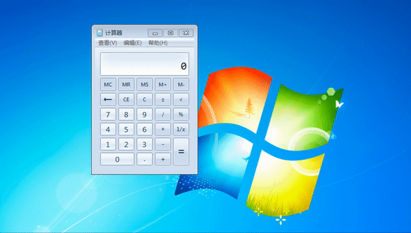
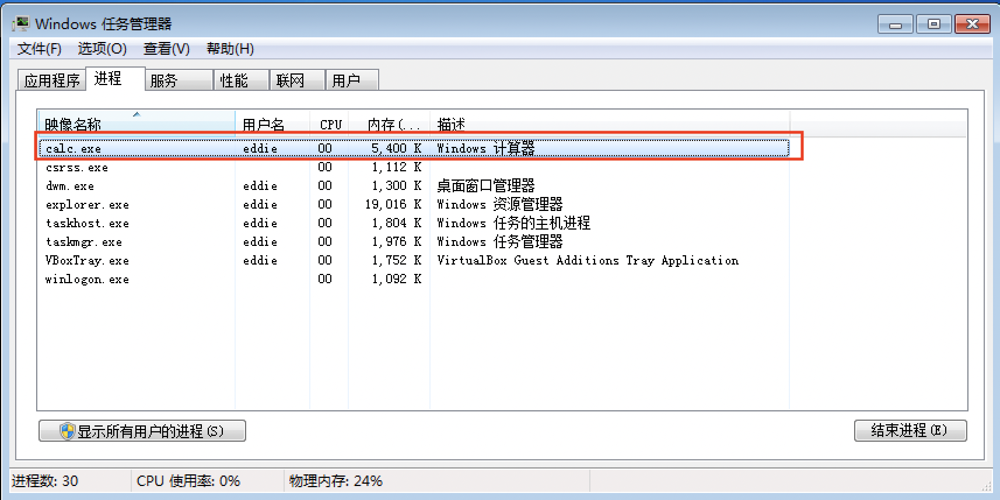
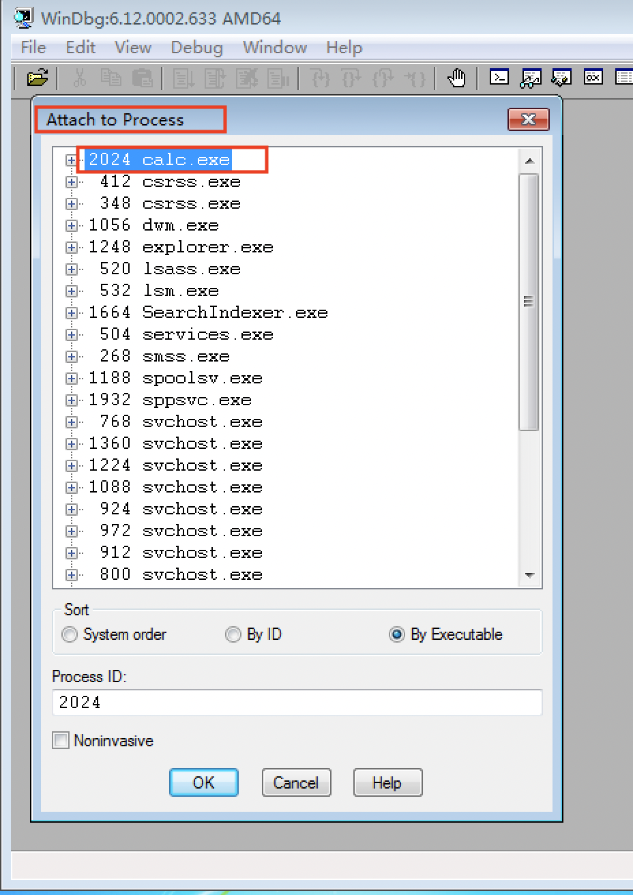
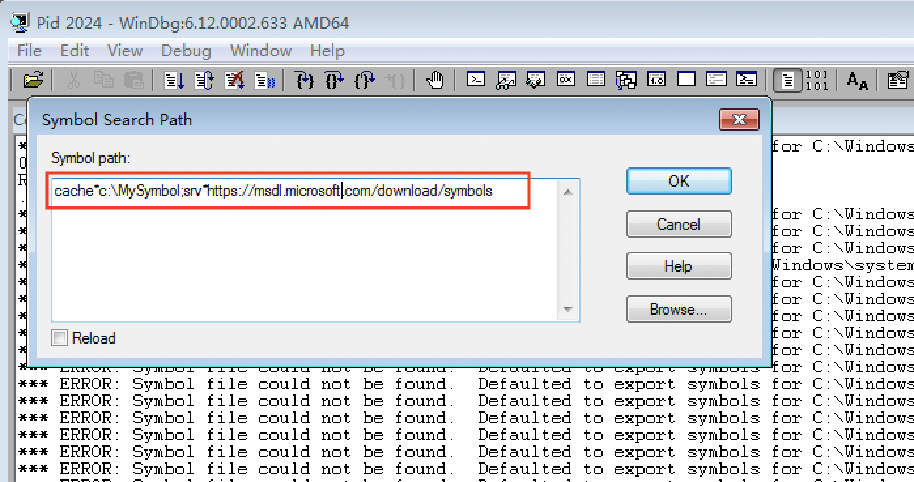
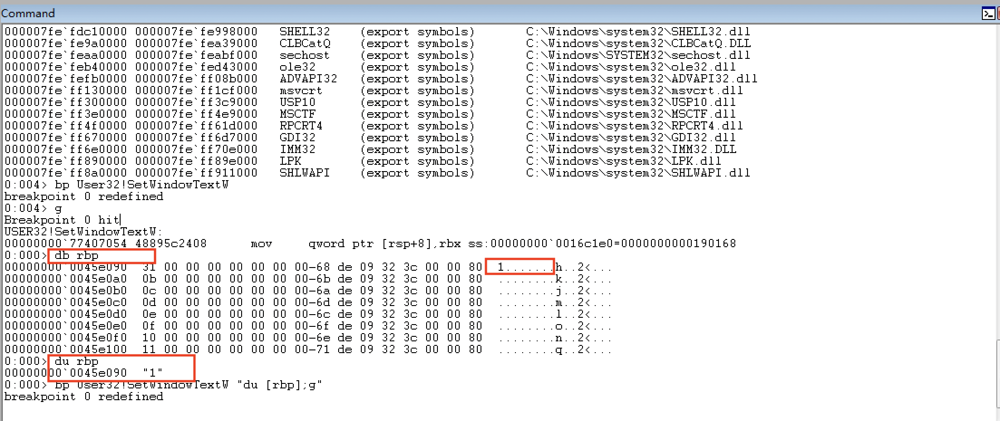
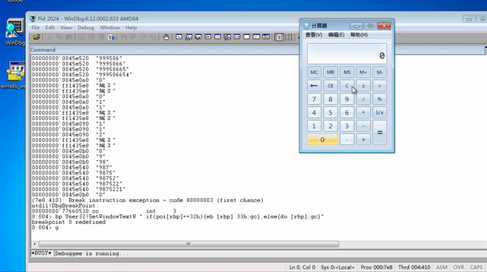
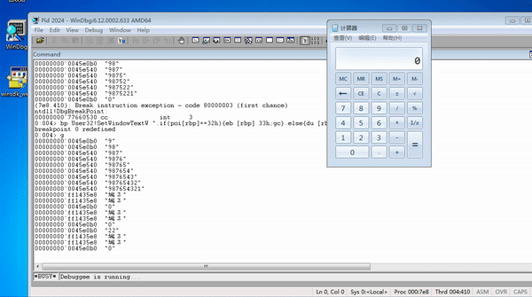
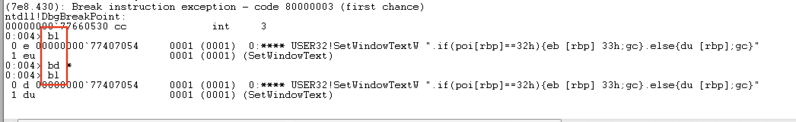
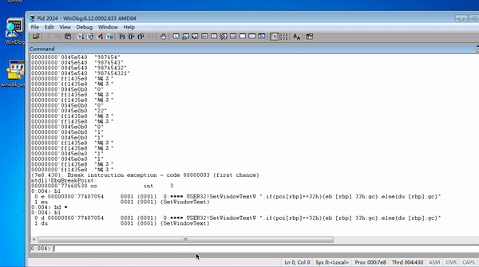

# 逆向工程第五次实验
## 实验目的
- 深入理解Windows API；
- 掌握WinDbg的使用方法；
- 通过篡改API的结果或参数来改变软件的行为。
## 一、先验知识
#### 1.关键的API：SetWindowText
- 作用：把窗口中的内容设置文本，或是输入一个字符串，对应窗口就能显示这个字符串。
- 调用SetWindowTypes：在控件上显示结果。对于计算器来说，就是显示计算结果。
#### 2.WinDbg调试命令
- `bp`:在某个地址下断点， 可以 `bp Address` 或 `bp 伪寄存器` 或 `bp符号名称`
- `bl`:（breakpoint list） 命令列出已存在的断点的信息
- `bd`:清除断点。
- `db`:显示字节值和ASCII码字符
- `du`:显示unicode字符.
- `g`:无条件恢复调试目标的执行。
- `gc`:命令使用和遇到断点时一样的方式(单步、跟踪或自由执行)来从一个条件断点恢复执行。
- `poi[ebp]`:对地址ebp求值
## 二、实验过程
### 1.准备工作
- 实验开始前，当前计算器结果为1+1=2
- 

- 使用dumpbin查看导入表
```bash
>dumpbin /imports: C:Windows\system32\calc.exe
```
- 找到计算器程序关键的API:`SetWindowText`
- 打开Windows任务管理器，找到计算器程序`calc.exe`

- 打开WinDbg
  - file -> attach to process -> calc.exe

### 2.设置断点
  - `bp SetWindowTextW` 下断点
 - 发现报错`Do expression:"SetWindowTextW":could not be resolved`,需要下载符号文件
- file ->symbolfilepath
    
- 下断点查看运行情况
   ```bash
   bp User32!SetWindowTextW
   ```
   - 计算器调用setwindowtext设置结果区域的文本，在界面上点击这个按钮，在计算器结果区域显示这个结果时就要调用一次setwindowtext
- 命中断点后，`g` ，每在计算器上点击一下，即可在Windbg上查看当前寄存器的情况
- 显示寄存器里的内容
```bash
   db rbp 
   du rbp 
```
- 如图，在计算器上点击1，用du命令查看此时寄存器中的unicode字符，是1，与刚才点击的值对应上了

- 同理，查看计算器上的各个数字按键，寄存器中的字符都与寄存器中的字符一一对应。

- Debug -> Break 停止调试
### 3.修改断点
- 对照ASCII可显示字符表可知：
  - 字符2对应的十进制为50，十六进制为32h；
  - 字符3对应的十进制为51，十六进制为33h；

- 使用以下语句修改断点
```bash
bp User32!SetWindowTextW ".if(poi[rbp]==32h){eb [rbp] 33h;gc}.else{du [rbp];gc}"
```
  - 如果显示rbp寄存器中指针指向的内容是32h（2），那么把rbp指针指向的内容改成33h（3），执行gc；否则显示，但不做任何修改
  - 计算器界面上点击的是非2，那就是正常显示;如果是2，就会变成3

### 4.验证结果
- 再次计算1+1,此时结果变为3，说明篡改成功
- 

### 5.恢复
- 篡改成功后，再把计算器恢复到正常状态。
```bash
bl ; 
bd * ;
bl ;
```

- 清除断点后，计算器又恢复1+1=2了
- 

## 三、参考资料
- 老师提供的课程资料
- [Windbg新手入坑指南](https://www.52pojie.cn/thread-924116-1-1.html)
- [Exploit开发系列教程-Windbg](https://mp.weixin.qq.com/s/unsespeky1P9GokjyA2bjA)
- [CWindow::SetWindowText](https://docs.microsoft.com/en-us/previous-versions/wfaxc8w5(v=vs.140)?redirectedfrom=MSDN)
