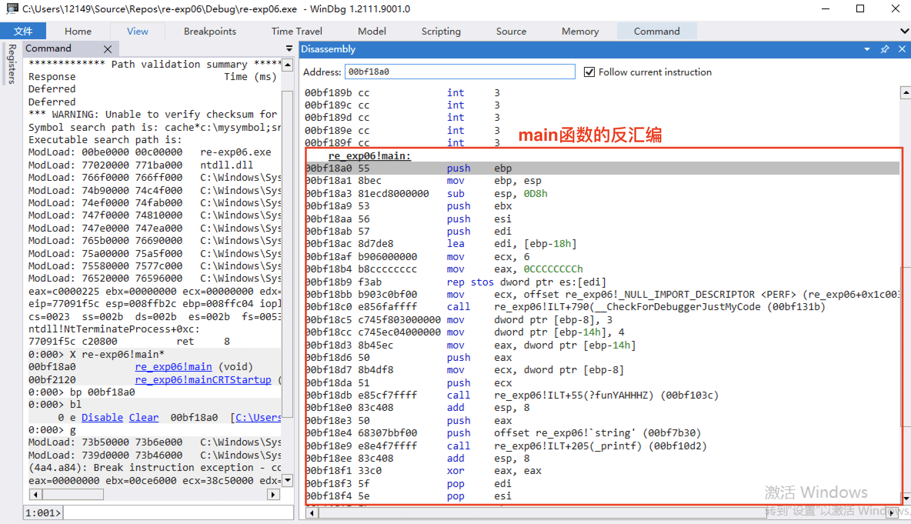
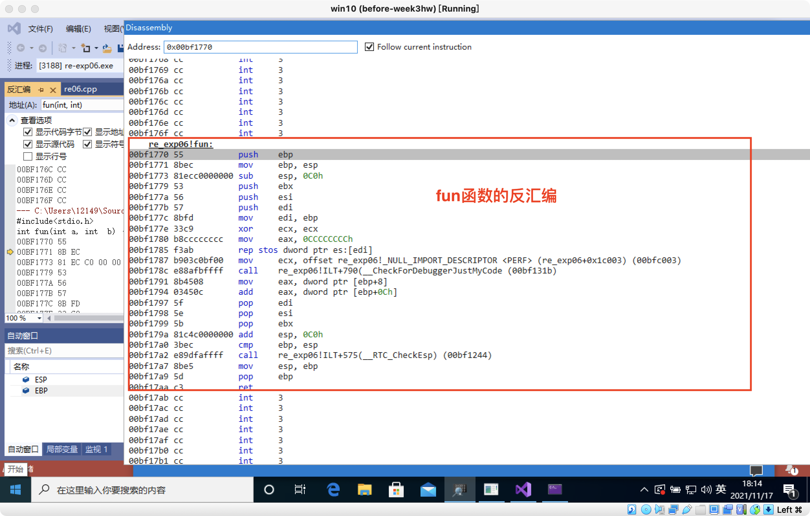

# 逆向工程第六次实验

## 实验要求
- 编译生成一个两个数相加求和的可执行程序；
- 使用Windbg工具获取该程序的反汇编并加以注释。

## 实验过程
### 1. 生成`re-exp06.exe`程序
- 源代码如下：
```c
#include<stdio.h>
int fun(int a, int  b) {
 return a + b;
}

int main() {
 int a = 3, b = 4;
 printf("%d", fun(a, b));
}
```
### 2. 打开Windbg进入开启调试
  - `X re-exp06!main* `:找到main函数入口；
  - `bp 00bf18a0`:在main函数开始处下断点；
  - `bl`:查看当前所有断点
  - `g`:运行至断点处</b>

### 3. 获取反汇编代码并逐语句注释
- `main`函数：</b>
```asm
int main() {
00BF18A0 55                   push        ebp //压栈，将ebp的地址存入esp所指向位置的上面4个字节内）
00BF18A1 8B EC                mov         ebp,esp  //让ebp指向esp所指向的位置
00BF18A3 81 EC D8 00 00 00    sub         esp,0D8h //让esp指向esp减去0D8h的位置
 
00BF18A9 53                   push        ebx //ebx寄存器入栈
00BF18AA 56                   push        esi //esi寄存器入栈
00BF18AB 57                   push        edi //edi寄存器入栈
00BF18AC 8D 7D E8             lea         edi,[ebp-18h] //让edi指向ebp减去18h的位置
 
00BF18AF B9 06 00 00 00       mov         ecx,6 //将6h存入ecx中

00BF18B4 B8 CC CC CC CC       mov         eax,0CCCCCCCCh 
00BF18B9 F3 AB                rep stos    dword ptr es:[edi] //初始化内存空间：从edi处开始，将eax(0CCCCCCCCh)的内容存储到edi中存储的地址（[ebp-0D8h]）开始的向上的位置里去，一直重复ecx(6h)次。
  
00BF18BB B9 03 C0 BF 00       mov         ecx,offset _F201C302_re06@cpp (F201C302) //把有效地址[F201C302]给ecx
 
00BF18C0 E8 56 FA FF FF       call        @__CheckForDebuggerJustMyCode@4 (0BF131Bh) //允许调试器跳过“系统，框架，库和其他非用户调用”
 
 int a = 3, b = 4;
00BF18C5 C7 45 F8 03 00 00 00 mov         dword ptr [a],3 //将3存入a所指向的内存空间内
00BF18CC C7 45 EC 04 00 00 00 mov         dword ptr [b],4 //将4存入b所指向的内存空间内
 printf("%d", fun(a, b));
00BF18D3 8B 45 EC             mov         eax,dword ptr [b] //把b指向的内存空间中的值存入eax中
00BF18D6 50                   push        eax  //eax中的内容入栈

00BF18D7 8B 4D F8             mov         ecx,dword ptr [a] //把a指向的内存空间中的值存入ecx中  
00BF18DA 51                   push        ecx  //ecx中的内容入栈
00BF18DB E8 5C F7 FF FF       call        fun (0BF103Ch)  //调用fun函数
00BF18E0 83 C4 08             add         esp,8 //给esp加8,esp向栈顶方向移动8

00BF18E3 50                   push        eax //eax寄存器中的值入栈
00BF18E4 68 30 7B BF 00       push        offset string "%d" (0BF7B30h)  
00BF18E9 E8 E4 F7 FF FF       call        _printf (0BF10D2h) //调用printf函数 
00BF18EE 83 C4 08             add         esp,8 //给esp加8,esp向栈顶方向移动8
}
00BF18F1 33 C0                xor         eax,eax //eax与自己异或，即清零
00BF18F3 5F                   pop         edi  //edi中的内容出栈
00BF18F4 5E                   pop         esi  //esi中的内容出栈
00BF18F5 5B                   pop         ebx  //ebx中的内容出栈
00BF18F6 81 C4 D8 00 00 00    add         esp,0D8h //esp向栈顶移动0D8h

00BF18FC 3B EC                cmp         ebp,esp  //检查ebp和esp是否一致，然后调用__RTC_CheckEsp

00BF18FE E8 41 F9 FF FF       call        __RTC_CheckEsp //当ebp和esp不相等的时候，跳转到esperror标号报告错误，否则就直接返回函数。
(0BF1244h)  
00BF1903 8B E5                mov         esp,ebp //把ebp中的内容给esp
00BF1905 5D                   pop         ebp  //ebp出栈
00BF1906 C3                   ret //返回
```

- `fun`函数:</b>
```asm
int fun(int a, int  b) {
00BF1770 55                   push        ebp  //ebp入栈
00BF1771 8B EC                mov         ebp,esp  //让ebp指向e
sp所指向的位置
00BF1773 81 EC C0 00 00 00    sub         esp,0C0h //让esp向栈底移动0C0h

00BF1779 53                   push        ebx  //ebx入栈
00BF177A 56                   push        esi  //esi入栈
00BF177B 57                   push        edi  //edi入栈
00BF177C 8B FD                mov         edi,ebp //让edi指向ebp所指向的位置
00BF177E 33 C9                xor         ecx,ecx //ecx清零
00BF1780 B8 CC CC CC CC       mov         eax,0CCCCCCCCh  
00BF1785 F3 AB                rep stos    dword ptr es:[edi] //初始化内存空间：从edi当前位置开始，重复将eax(0CCCCCCCCh)的内容存储到edi中存储的地址（[ebp-0CCh]）开始的向上的位置里去。
00BF1787 B9 03 C0 BF 00       mov         ecx,offset _F201C302_re06@cpp (0BFC003h) //把有效地址[F201C302]给ecx
  00000023: E8 00 00 00 00 
00BF178C E8 8A FB FF FF       call        @__CheckForDebuggerJustMyCode@4 (0BF131Bh) //允许调试器跳过“系统，框架，库和其他非用户调用”
 
 return a + b;
00BF1791 8B 45 08             mov         eax,dword ptr [a] //将a指向的内存空间中的内容存入eax中
00BF1794 03 45 0C             add         eax,dword ptr [b] //将b指向的内存空间中的内容与eax相加并存入eax中 
}
00BF1797 5F                   pop         edi //edi寄存器中的内容出栈

00BF1798 5E                   pop         esi //esi寄存器中的内容出栈

00BF1799 5B                   pop         ebx //ebx寄存器中的内容出栈
00BF179A 81 C4 C0 00 00 00    add         esp,0C0h //给esp向栈顶方向移动0CCh

00BF17A0 3B EC                cmp         ebp,esp //检查ebp和esp是否一致，然后准备调用__RTC_CheckEsp
00BF17A2 E8 9D FA FF FF       call        __RTC_CheckEsp (0BF1244h)  
00BF17A7 8B E5                mov         esp,ebp //让esp指向ebp所指向的位置

00BF17A9 5D                   pop         ebp //ebp出栈
00BF17AA C3                   ret //返回
```


## 参考资料

- [rep stos 指令(Intel汇编)](https://blog.csdn.net/ypist/article/details/8467163)
- [C++反汇编揭秘2 – VC编译器的运行时错误检查(RTC)](https://blog.csdn.net/ATField/article/details/1556844)