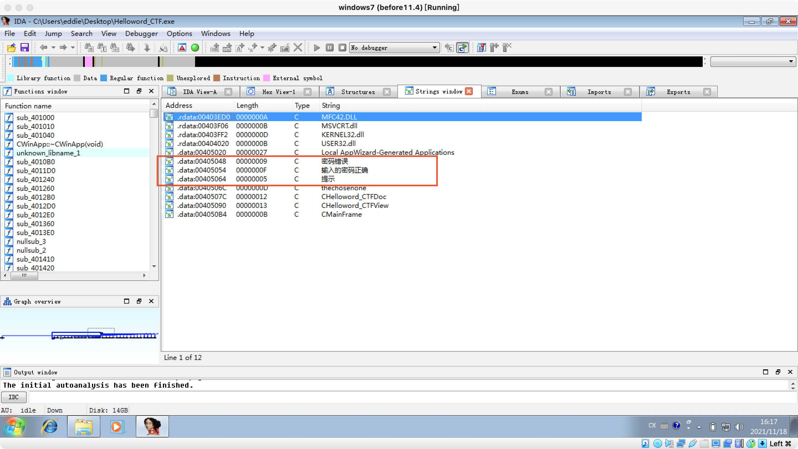
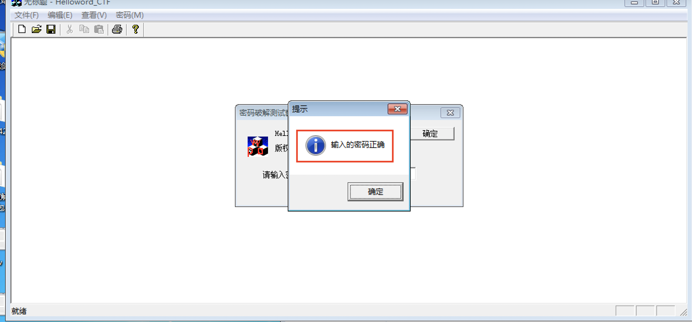
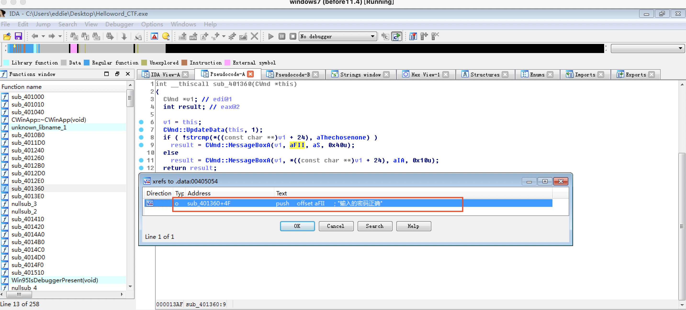
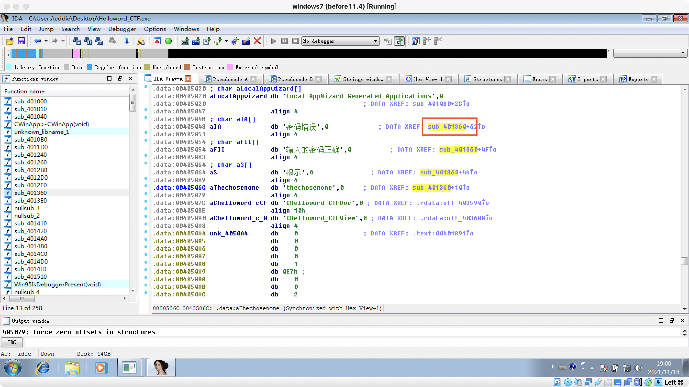
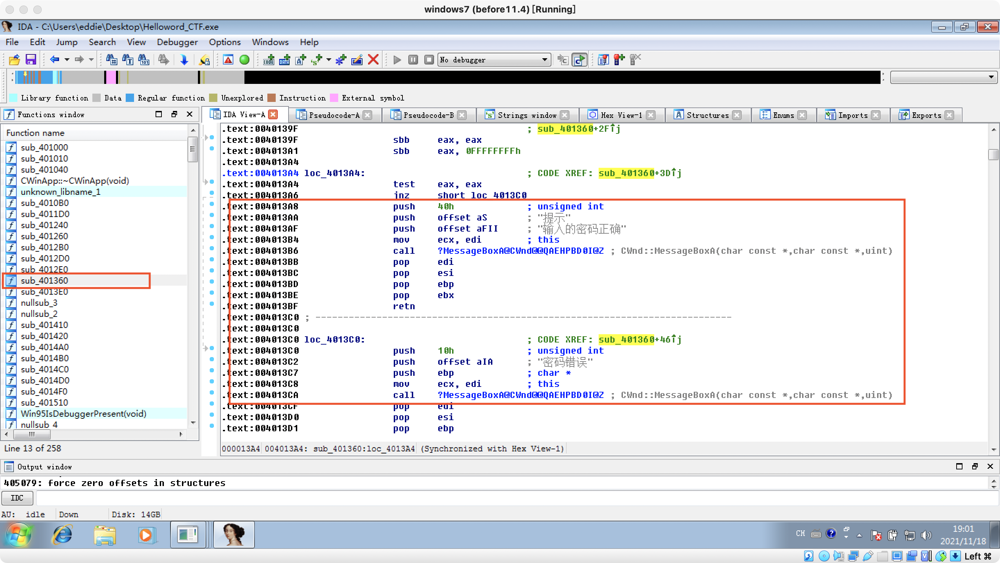
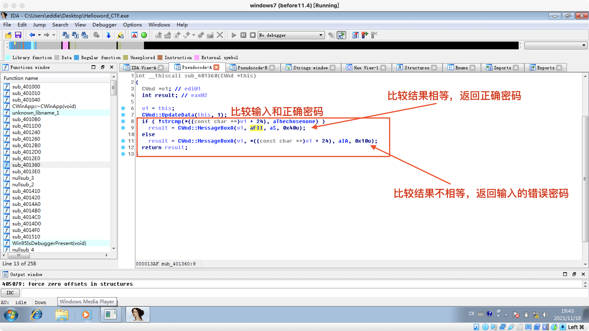
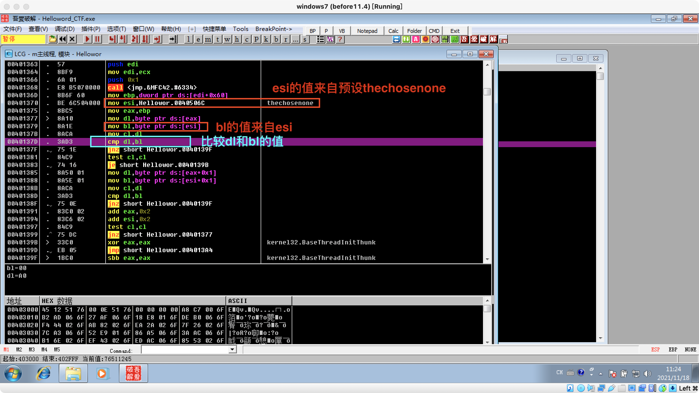

# 逆向工程第七次实验
## 实验目的
- 破解`helloworld_CTF.exe`的密码

## 实验环境
- Windows 7
- IDA x86

## 实验过程
- 在IDA点击`View` - `Open subviews`- `Strings`</b>可以看到有类似于跟逻辑处理相关的字符串。
### 方法一
- 仔细观察`Strings`显示出的信息，发现`thechosenone`引人注目，尝试将其输入密码框并回车，成功。</b>

### 方法二
- 查看关键函数的反汇编代码</b>
- 发现逻辑处理相关字符串与函数`sub_401360`有关</b>
- 查看函数`sub_401360`的反汇编代码（含关键逻辑判别语句的注释）</b>
```asm
.text:00401360 ; int __thiscall sub_401360(CWnd *this)
.text:00401360 sub_401360      proc near               ; DATA XREF: .rdata:00403580o
.text:00401360                 push    ebx
.text:00401361                 push    ebp
.text:00401362                 push    esi
.text:00401363                 push    edi
.text:00401364                 mov     edi, ecx
.text:00401366                 push    1               ; int
.text:00401368                 call    ?UpdateData@CWnd@@QAEHH@Z ; CWnd::UpdateData(int)
.text:0040136D                 mov     ebp, [edi+60h]
/*把预设的"thechosenone"移入寄存器esi中*/
.text:00401370                 mov     esi, offset aThechosenone ; "thechosenone" 
.text:00401375                 mov     eax, ebp
.text:00401377
.text:00401377 loc_401377:                             ; CODE XREF: sub_401360+39j
/*把eax中的内容移入dl中*/
.text:00401377                 mov     dl, [eax]
/*把esi中的内容（thechosenone）移入bl中*/
.text:00401379                 mov     bl, [esi]
/*把dl中的内容（原eax中的内容）移入cl中*/
.text:0040137B                 mov     cl, dl
/*比较dl和bl的内容*/
.text:0040137D                 cmp     dl, bl
/*如果不相等，则跳转（短转移）值0040139F处执行*/
.text:0040137F                 jnz     short loc_40139F
/*测试cl是否为空，若为空则跳转至0040139B处执行*/
.text:00401381                 test    cl, cl
.text:00401383                 jz      short loc_40139B
.text:00401385                 mov     dl, [eax+1]
.text:00401388                 mov     bl, [esi+1]
.text:0040138B                 mov     cl, dl
.text:0040138D                 cmp     dl, bl
.text:0040138F                 jnz     short loc_40139F
.text:00401391                 add     eax, 2
.text:00401394                 add     esi, 2
.text:00401397                 test    cl, cl
.text:00401399                 jnz     short loc_401377
.text:0040139B
.text:0040139B loc_40139B:                             ; CODE XREF: sub_401360+23j
/*清空eax并跳转至004013A4处执行*/
.text:0040139B                 xor     eax, eax
.text:0040139D                 jmp     short loc_4013A4
.text:0040139F ; ---------------------------------------------------------------------------
.text:0040139F
.text:0040139F loc_40139F:                             ; CODE XREF: sub_401360+1Fj
.text:0040139F                                         ; sub_401360+2Fj
.text:0040139F                 sbb     eax, eax
.text:004013A1                 sbb     eax, 0FFFFFFFFh
.text:004013A4
.text:004013A4 loc_4013A4:                             ; CODE XREF: sub_401360+3Dj
/*检查eax是否为空，若不空，则跳转至004013C0处执行*/
.text:004013A4                 test    eax, eax
.text:004013A6                 jnz     short loc_4013C0
.text:004013A8                 push    40h             ; unsigned int
/*如果eax是否为空则弹出提示密码正确的窗口*/
.text:004013AA                 push    offset aS       ; "提示"
.text:004013AF                 push    offset aFII     ; "输入的密码正确"
.text:004013B4                 mov     ecx, edi        ; this
.text:004013B6                 call    ?MessageBoxA@CWnd@@QAEHPBD0I@Z ; CWnd::MessageBoxA(char const *,char const *,uint)
.text:004013BB                 pop     edi
.text:004013BC                 pop     esi
.text:004013BD                 pop     ebp
.text:004013BE                 pop     ebx
.text:004013BF                 retn
.text:004013C0 ; ---------------------------------------------------------------------------
.text:004013C0
.text:004013C0 loc_4013C0:                             ; CODE XREF: sub_401360+46j
.text:004013C0                 push    10h             ; unsigned int
/*如果eax不空，则弹出密码错误窗口，并显示输入的错误密码内容*/
.text:004013C2                 push    offset aIA      ; "密码错误"
.text:004013C7                 push    ebp             ; char *
.text:004013C8                 mov     ecx, edi        ; this
.text:004013CA                 call    ?MessageBoxA@CWnd@@QAEHPBD0I@Z ; CWnd::MessageBoxA(char const *,char const *,uint)
.text:004013CF                 pop     edi
.text:004013D0                 pop     esi
.text:004013D1                 pop     ebp
.text:004013D2                 pop     ebx
.text:004013D3                 retn
.text:004013D3 sub_401360      endp
.text:004013D3
```
- 查看函数的伪代码</b>
- 结合反汇编和伪代码分析知，本程序关键在于**比较输入的密码（存在dl中的值）与正确的密码（存在bl中的值）**
- 而bl的值又是esi中的值赋给的，于是就要找esi中的值，从下述语句中可以发现esi中的值来自预设aThechosenone，从该预设中可以看到其内容为“thechosenone”
```c
.text:00401370                 mov     esi, offset aThechosenone ; "thechosenone" 
```

- 与在`ollydbg`观察到的反汇编分析结果一致</b>
- 因此推测出正确密码为**thechosenone**
