# 逆向工程第八次实验
## 实验要求
在`HelloWorld_CTF.exe`的基础上手动修改二进制文件，实现在点开程序时弹出`Hello World`弹窗，后续功能不变。
## 实验目的
- 掌握程序的PE文件结构
- 掌握OllyDbg工具的使用
- 掌握反汇编指令及汇编代码
- 掌握函数的调用

## 实验原理
- 实现预期功能的思路是：找到函数尾部空白处，手动修改程序的逻辑
- 即程序运行时，首先跳转到弹框区域，再跳转回来去执行原来的代码

## 实验过程
#### 1.查看MessageBox的地址以及参数入栈的方式
- 打开OllyDbg将exe文件拖入分析
- 右键-查找-名称，找到`&USER32.MessageBoxW`，并记下地址71001264</b>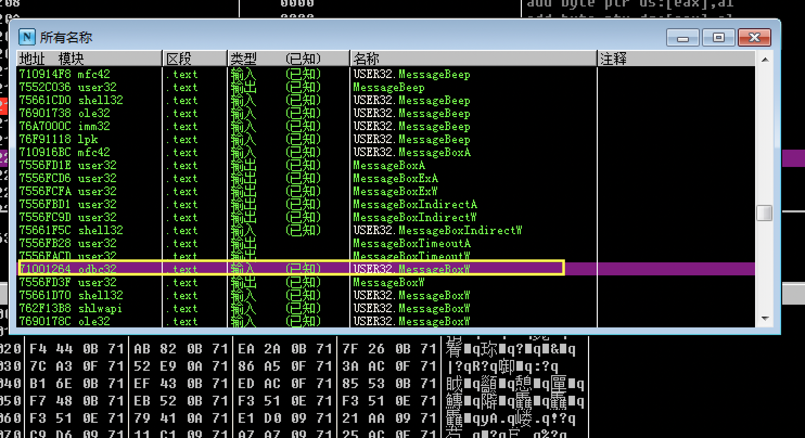
- 查看原`Hello World_CTF.exe`对`MessageBox`的调用情况
- 资料显示`&MFC42.#4224`为`MessageBox`，找到并查看本地调用情况</b>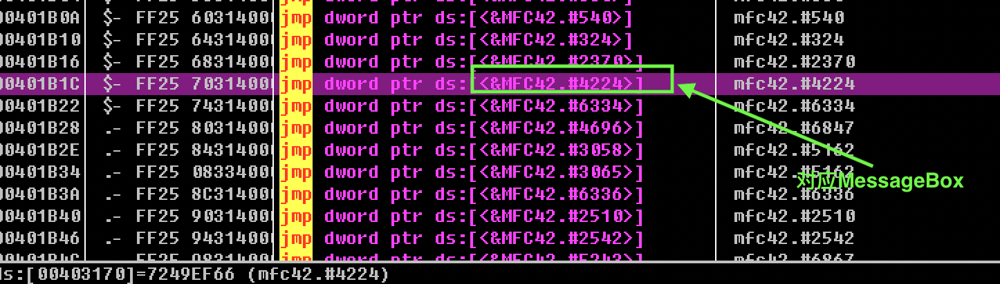
- 找到`004013B6`，`call &MFC42.#4224`上方有两条Push指令，根据其Push的对应内容，结合分析推断第一条Push指令用于将弹窗标题入栈，第二条Push指令用于将弹窗内容入栈 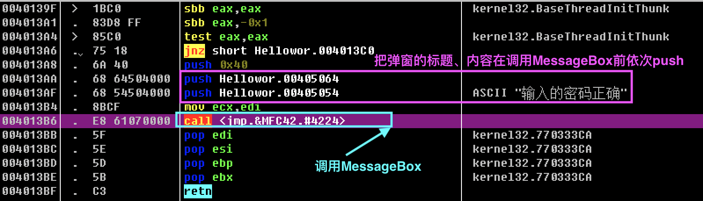
- 由此可见，若需自行添加弹窗可以参考类似的模式，即用以下语句：
```asm
push 0 
push [弹窗标题存放的地址]
push [弹窗内容存放的地址]
push 0
call dword ptr ds:[&User32.MessageBoxW]
……
```
#### 2. 找到函数尾部的空白处
- 使用`Stu_PE`工具，查看程序结构，找到text节区</b>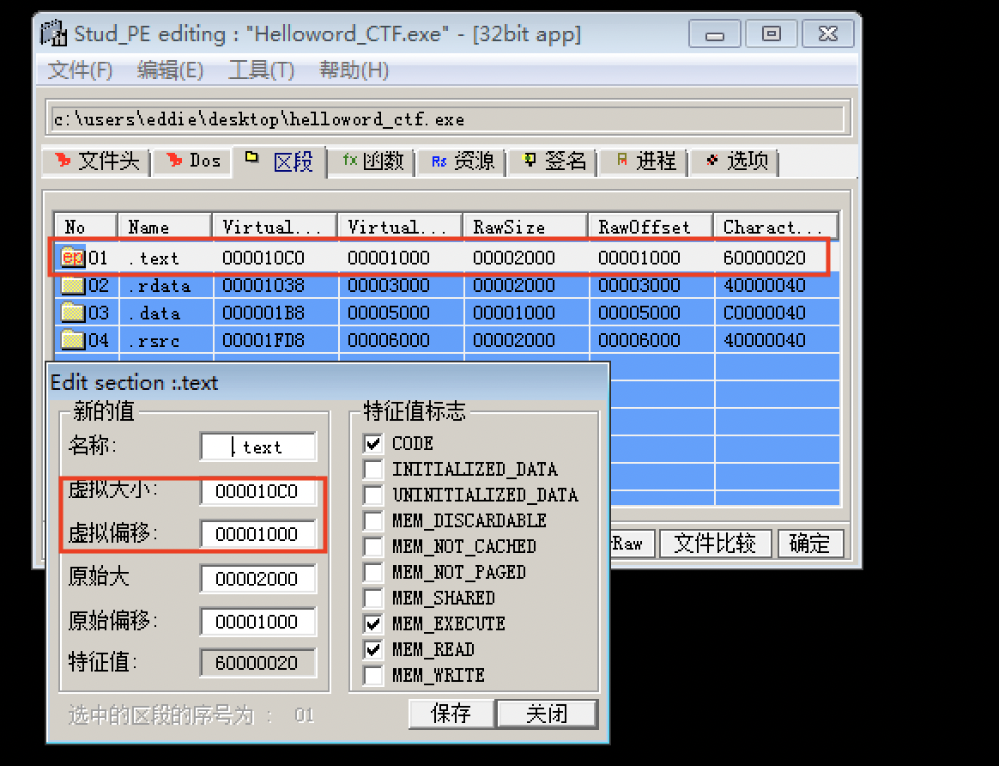
- 虚拟大小000010C0+虚拟偏移00001000=000020C0找到代码区的代码结束处,此处即是开始手动添加代码的地方</b>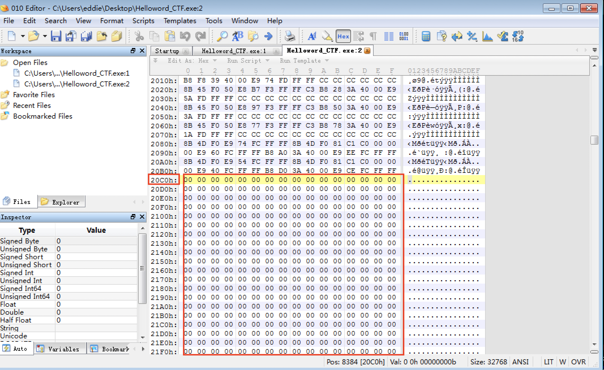

#### 3.手动添加代码
- 首先定位到原始exe文件的entrypoint`00401DA0`处，将此地址直到`00401DCB`处的所有内容的二进制复制，然后使用NOP填充</b>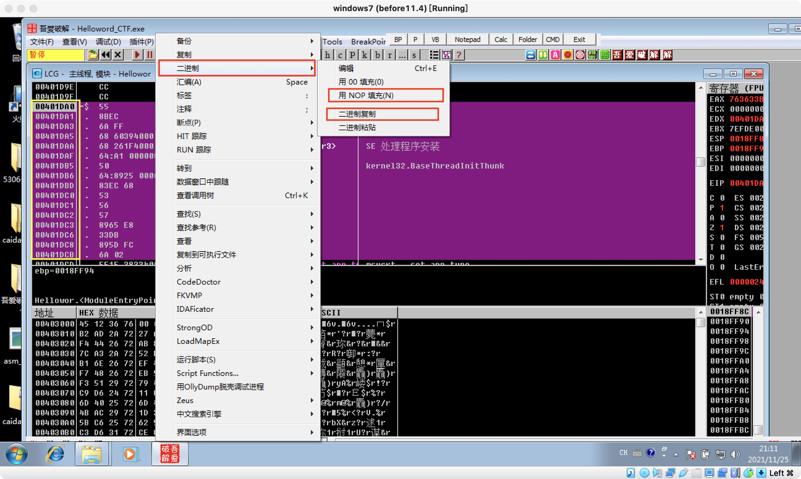
  - 对应的汇编指令及其二进制如下
```asm
/*汇编*/
00401DA0 >/$  55            push ebp
00401DA1  |.  8BEC          mov ebp,esp
00401DA3  |.  6A FF         push -0x1
00401DA5  |.  68 60394000   push Hellowor.00403960
00401DAA  |.  68 261F4000   push <jmp.&MSVCRT._except_handler3>      ;  SE 处理程序安装
00401DAF  |.  64:A1 0000000>mov eax,dword ptr fs:[0]
00401DB5  |.  50            push eax                                 ;  kernel32.BaseThreadInitThunk
00401DB6  |.  64:8925 00000>mov dword ptr fs:[0],esp
00401DBD  |.  83EC 68       sub esp,0x68
00401DC0  |.  53            push ebx
00401DC1  |.  56            push esi
00401DC2  |.  57            push edi
00401DC3  |.  8965 E8       mov [local.6],esp
00401DC6  |.  33DB          xor ebx,ebx
00401DC8  |.  895D FC       mov [local.1],ebx
00401DCB  |.  6A 02         push 0x2

/*二进制*/
55 8B EC 6A FF 68 60 39 40 00 68 26 1F 40 00 64 A1 00 00 00 00 50 64 89 25 00 00 00 00 83 EC 68
53 56 57 89 65 E8 33 DB 89 5D FC 6A 02
```
>以上复制和覆盖填充的内容是原始exe文件中第一个函数，稍后将用自己编写的函数替代

- 函数尾部空白处再往下空几行，从`004020D0`处开始添加代码
- 依次修改汇编如下</b>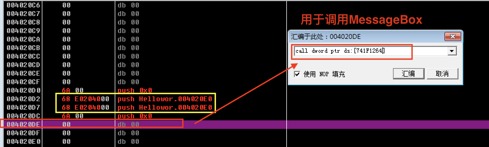
> - 其中,地址`004020D2`和`004020D7`中push的地址先随便填写，目的只是为了暂时占位，稍后将把弹窗标题及内容存放的地址依次填入；
> - 地址`004020DE`填写call dword ptr ds:[&User32.MessageBoxW]，目的是为了调用弹窗MessageBox函数
- 在`004020E4`处将原始exe入口函数的二进制复制进来</b>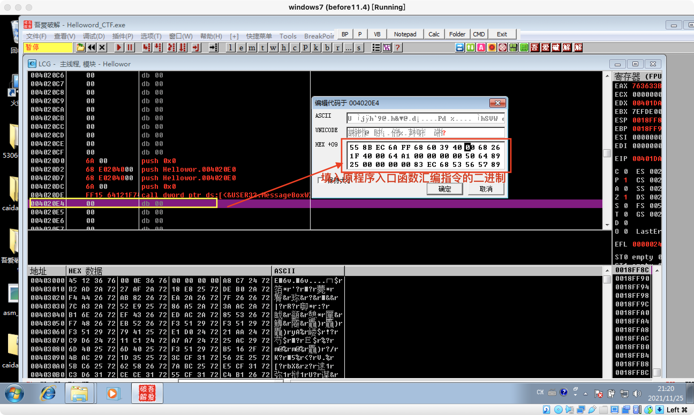
- 在本段汇编的末尾处新增语句`jmp 00401DCD`</b>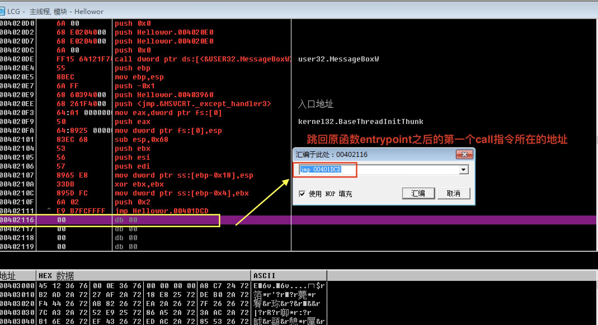
> 目的是为了跳转到原exe文件中该入口函数的下一行指令处，以保持新exe文件后续功能与原exe文件一致

- 再往下空几行，在`00402120`地址上右击-编辑-二进制编辑,在UNICODE区域填入`Title`;在`0040212A`地址上右击-编辑-二进制编辑,在UNICODE区域填入`HelloWorld`</b>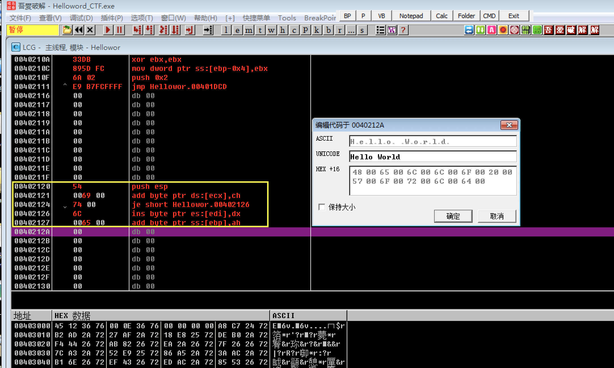</b>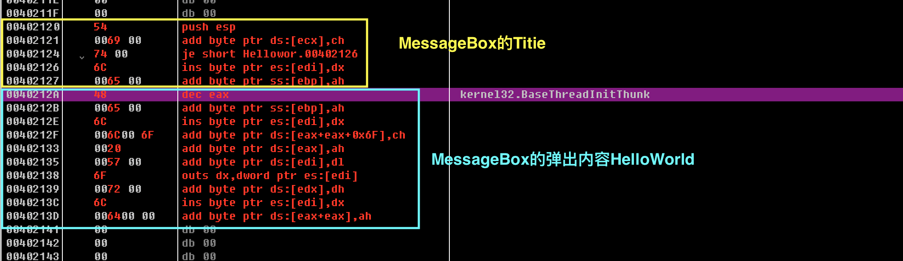

- 回到地址`004020D2`和`004020D7`处，把刚刚用于占位的地址分别用`00402120`和`0040212A`替代</b>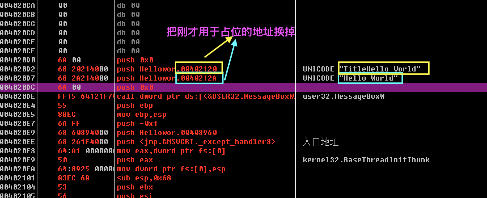

- 修改启动逻辑,在原始代码EntryPoint地址处填上`jmp 004020D0`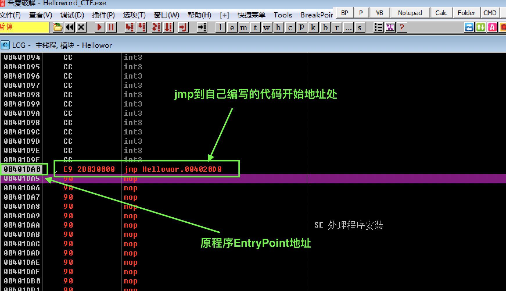
> 这样在程序启动时，首先会定位到我们自己编写的代码段，实现弹窗`Hello World`后再按原程序逻辑运行

- 这样就修改成功啦！右击-编辑-复制所有修改到可执行文件保存修改

## 实验结果
#### 上述修改后程序执行结果如下
</b>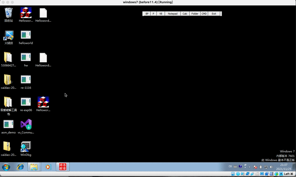
- 首先点开程序时出现`Hello World`弹窗；
- 取消弹窗后，程序与源程序完全一致：
  - 输入错误密码，弹窗提示密码错误并返回刚才的键入；
  - 输入正确密码，弹窗提示输入密码正确。

## 参考资料
- [手动修改二进制文件，实现在代码区中添加自己的一段代码](https://blog.csdn.net/ProgrammeringLearner/article/details/52096138)
