# 逆向工程 第九次实验报告
## 实验要求
- 编写一个小程序，读入文本文件里面的内容，指定到Attack函数的返回地址，在Attack函数中调用和弹出其他程序，如系统的记事本、计算器等。
## 实验目的
- 学习栈溢出漏洞原理及防范方式
- 学习函数调用时各寄存器的活动过程
- 熟悉函数调用的过程
## 先验知识
- #### `缓冲区溢出漏洞`：</b>
  在设计计算机系统软件或者应用软件时，采用了一些年代久远如汇编，C,C++等编程语言，而这些语言在设计指出并没有考虑在内存管理上的安全性，十分依赖程序员，所以当采用了不安全的函数(例如C的puts())来接受输入的数据时，因为没有考虑到数据的长度的合法性，可能会造成数据超过本来的应有长度，从而覆盖掉后面的数据，之后程序读取后面的数据时便会发生各种错误，引发风险。
- #### `漏洞产生原因`：</b>
  以C语言为例，在C语言设计之初，因为计算机的硬件资源十分有限，因此自动化的内存管理（如Java,Python的垃圾回收机制）和内存检查（如数组的边界检查）的实现是不现实的，需要程序员手动进行内存的管理，这在当时并没有什么不妥，而且当时C语言设计人员也是着重考虑功能的增强，也没有考虑安全性问题，所以就有了各种安全性漏洞的产生，其中比较多的就是缓冲区溢出漏洞

- #### `Win32系统提供两个特殊的寄存器用于标识位于系统栈顶端的栈帧`：
  1. ESP：栈指针寄存器，其内存放着一个指针，该指针永远指向系统栈最上面一个栈帧的栈顶；
  2. EBP：基址指针寄存器，其内存放着一个指针，该指针永远指向系统栈最上面一个栈帧的底部。

- #### `函数调用过程`
- **调用者**：
   1. 将被调用函数的参数按照从右到左的顺序压入栈中。
   2. 将返回地址压入栈中。这两件事都是调用者负责的，因此压入的栈应该属于调用者的栈帧。
- **被调用者**：
  1. 第一，将调用者的 %ebp 压入栈，此时 %esp 指向它。
  2. 将 %esp 的值赋给 %ebp, %ebp 就有了新的值，它也指向存放调用者 %ebp 的栈空间。这样，保存了调用者函数的 %ebp，并且建立了一个新的栈帧。

## 实验环境
- VM Windows7
- Visual Studio 2019
- IDA Pro x86
## 实验思路
- 在函数的栈帧中，局部变量是顺序排列的，且栈帧中保存着前栈帧EBP及返回地址RET等信息;
- 分析并调试漏洞程序，获得淹没返回地址的偏移;
- 构造`password.txt`使得str在读取该文件后恰能够覆盖`fun()`函数的返回地址，从而运行`attack()`函数。
- 向`password.txt`中写入可执行的机器代码，用来调用计算器程序`calc.exe`
</b>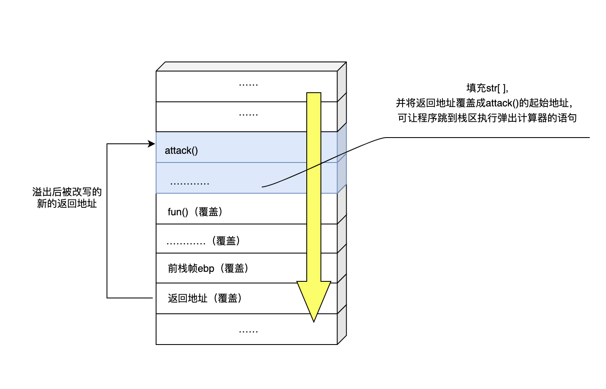
## 实验过程
#### 一、编译生成exe程序
- 使用`Visual Studio`完成编译，注意关闭安全检查</b>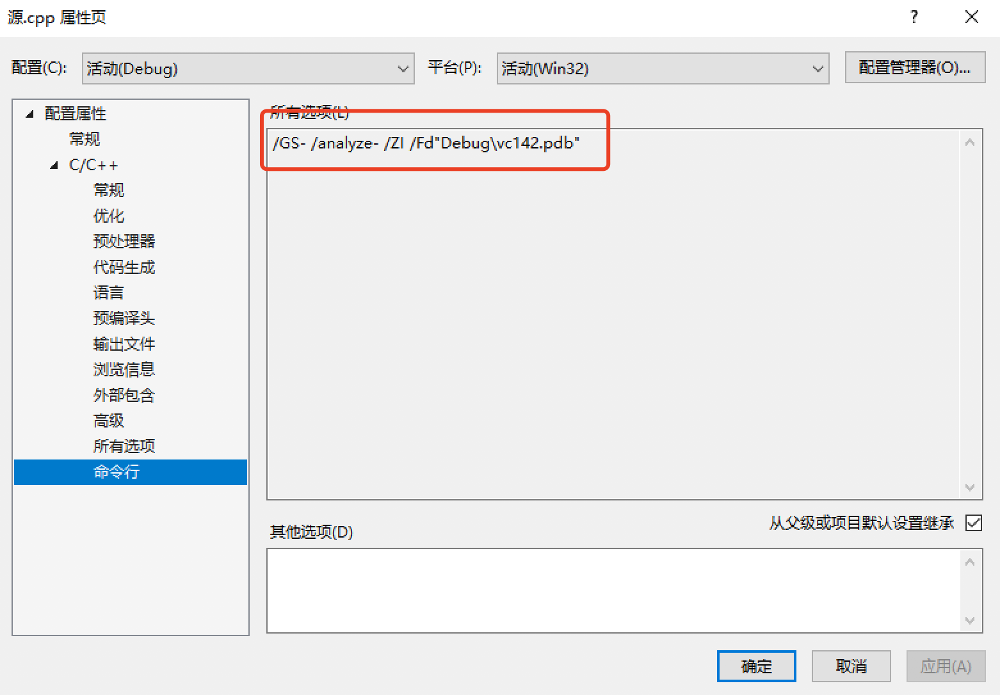
```c
#include <stdio.h>
#include <windows.h>

void attack(){
    printf("Attacked!\n");
    system("C:\\Windows\\System32\\calc.exe");//调用计算器程序
    exit(0);
}

void fun(){
    char password[6]="ABCDE";
    char str[6];
    FILE *fp;
    if(!(fp=fopen("password.txt","r"))){
        exit(0);
    }
    fscanf(fp,"%s",str);

    str[5]='\0';
    if(strcmp(str,password)==0)
        printf("OK!\n");
    else
        printf("NO!\n");
}

int main()
{
    fun();
    return 0;
}
```
#### 二、查看函数地址及ebp情况
- 在`main()`函数调用`fun()`函数处下断点
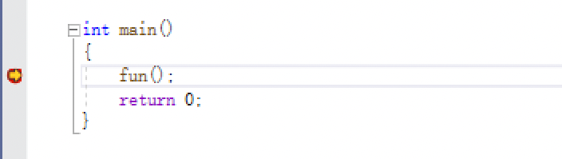
- 让程序运行到断点处，查看`main()`函数栈的ebp指针的值
  - 此时ebp指针的值为`008FFEF4`</b>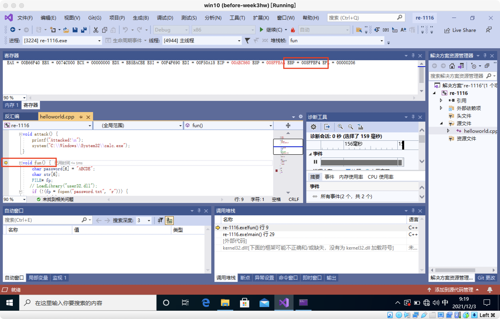
- 运行至进`fun()`函数中，查看`fun()`函数栈中ebp指针的值
  - 此时ebp指针的值为`008FFBA0`</b>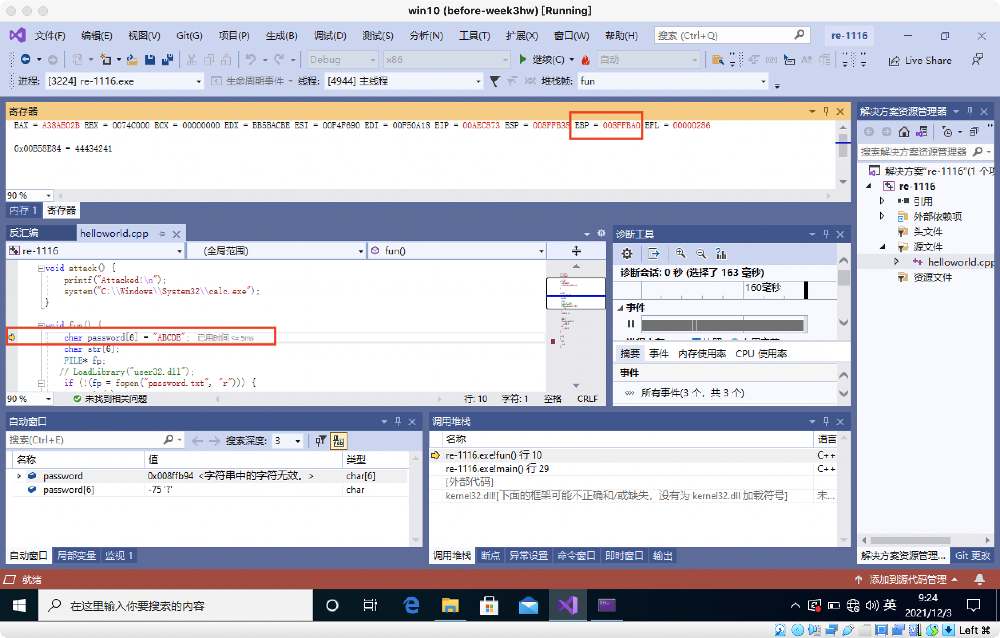

- 查看`fun()`函数栈中ebp指针指向的值</b>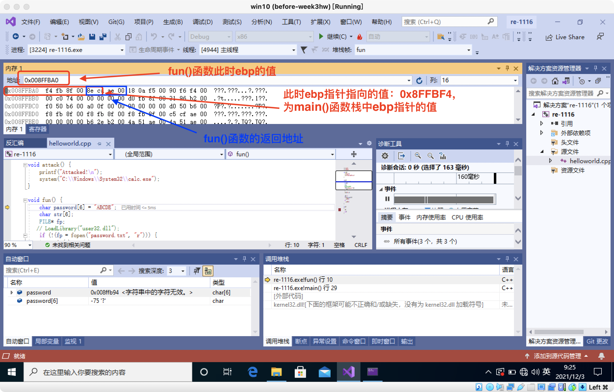
  - 分析知，fun()函数栈中,ebp指针指向的值是main()函数栈中ebp指针的值；
  - 由于栈的增长方向是**从高地址向低地址**增长的，故与ebp指针相邻着的**高地址位置**是函数栈的**返回地址**；
  - 计算知，`fun()`函数的返回地址是`0xAECA8E`；
  - 要使得`fun()`函数返回时成功地跳到`attack()`函数处去，即把`fun()`函数的返回地址覆盖为`attack()`函数的地址，实现跳转。
 


#### 三、分析并计算需要填充的字节长度及内容
- 查看`attack()`函数的地址
  - `attack()`函数的地址是`0xAEC820`</b>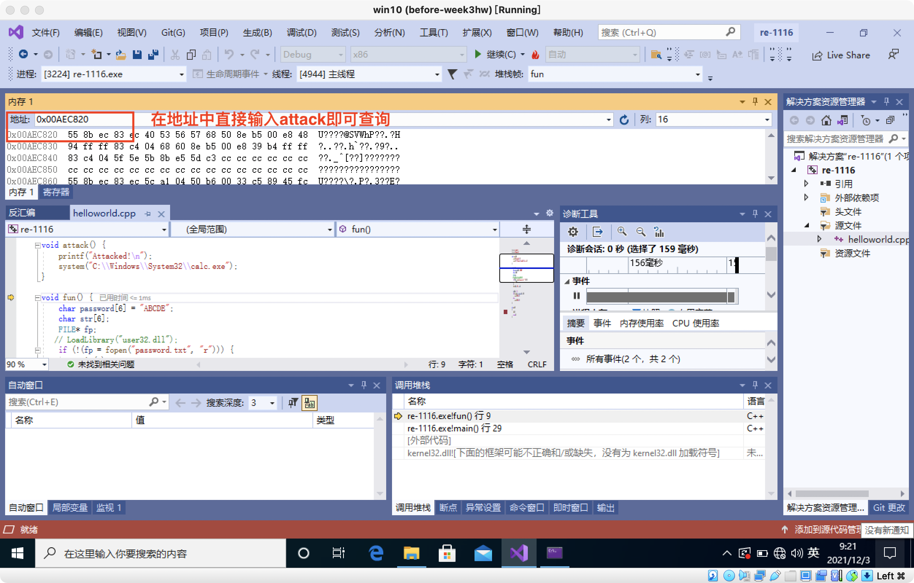

- 查看`str[]`数组的地址
  - `str[]`数组的地址是`0x8FFB8C`</b>
- `fun()`函数的ebp地址`008FFBA0`与str数组地址`008FFB8C`,相差24字节；
- `fun()`存储返回值的地址到ebp地址中间又相差了4个字节,返回地址的长度是4个字节;
- #### 所以，从`str[]`数组开始到完全覆盖`fun()`原返回地址共需输入24+4+4个字节的数据。

> PS：使用`IDA Pro x86`也可以进行验证，方法如下：
- 查看fun()反汇编</b>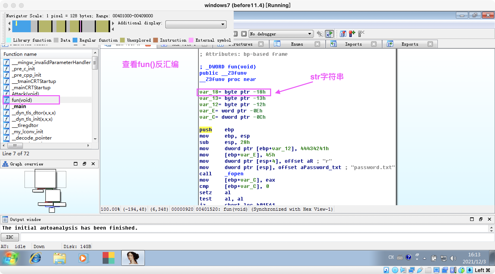
- 查看fun()堆栈情况</b>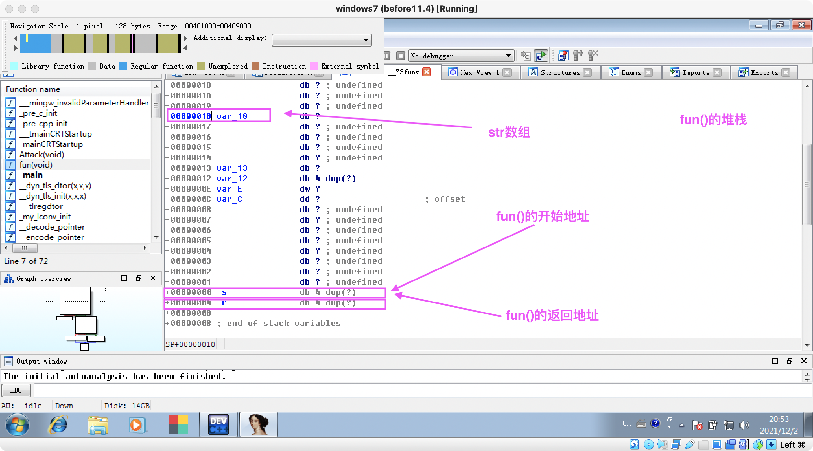
  - 从`- 00000018`到`+ 00000004`,共28字节。再加上返回地址长度4字节共32字节，与前序分析一致。
- 查看Attack()堆栈情况，可以看到开始地址及调用`calc.exe`</b>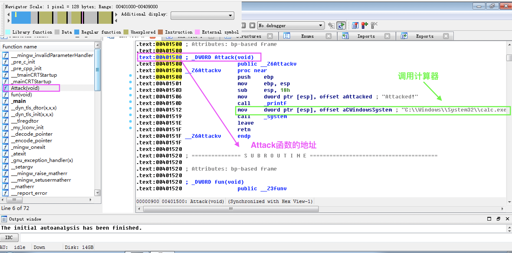

#### 四、构造`password.txt`
- 前28个字节为任意值，后4个字节为`attack()`的地址(注意，由于入栈顺序的原因，字节的值要从后往前写)。</b>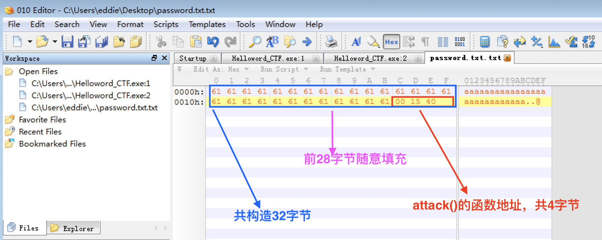


#### 五、漏洞利用成功
- 完成</b>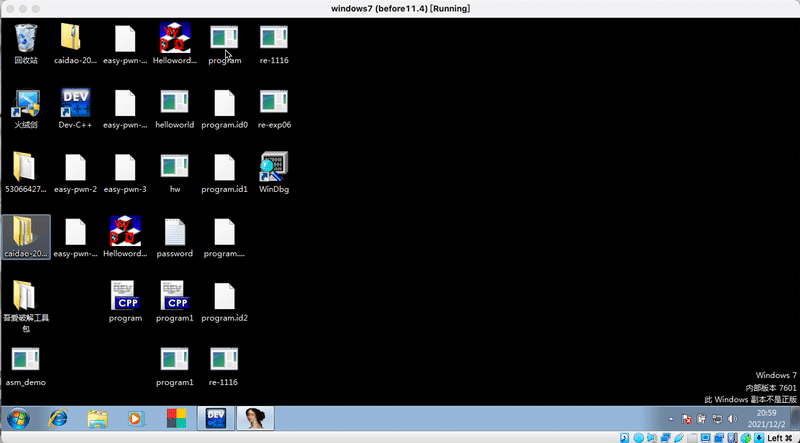
  - 显示“NO”，表明输入的密码不正确；
  - 显示“Attacked！”，表明成功进入`attack()`函数；
  - 弹出计算器，表明`attack()`函数执行成功。


## 实验总结
- 我们不会知道用户在控制台会输入多少字符，或是传入的txt有多少字符。输入的字符很可能很长，甚至可能包含了可执行代码的字节编码），此时栈溢出漏洞就会出现；
- 本题中,应用的`strcmp`等不安全的库函数也可能造成缓冲区溢出。
- 如何防范栈溢出漏洞？</b>
    | 作用        | 不推荐使用函数    |  推荐使用函数  |
    | --------   | :-----:   | :----: |
    | 拷贝字符串        | strcpy      |  strncpy |
    | 字符串比较        | strcmp     |   strncmp   |
    | 字符串连接       |strcat     | strncat  |
    | 格式化字符串并存入缓冲区        | sprintf| snprintf   |
    | 读取字符串        | gets    | fgets  |
    | 复制字符串        |	strdup    |  strndup  |
    | 字符串比较忽略大小写        | strcasecmp	   | strncasecmp  |
> 推荐使用的函数特点：限定了操作内容的大小，从而避免了缓冲区溢出（但可能也会带来截断）。
  - 编译器和操作系统也有很多机制，例如栈随机化，栈破坏检测，限制可执行代码区域等来对抗缓冲区溢出攻击。
> 在栈溢出的检查与防范方面，软件开发工具厂商及团体已经做了不少努力，如微软在Visual Studio系列中增加了栈溢出检查的编译选项。合理利用这些带安全特性的开发工具，可以提升系统的安全性，在遭受攻击时检查出程序中的数据溢出中止攻击行为。在操作系统方面，Windows系列操作系统中增加了SEHOP (SEH Overwrite Protection) ，以阻止攻击者通过修改SEH来利用漏洞，增强了系统的安全性，其它操作系统也有类似的机制来提升安全性。硬件方面，64位CPU中引入了NX（No-eXecute）硬件机制。其保护方法的本质，就是在内存中区分数据区与代码区，堆内存与栈内存都是数据区，程序代码部分则为代码区，当攻击使CPU跳转到数据区去执行时，就会异常终止。
- 缓冲区溢出造成的危害非常大，可能导致程序运行终止或程序运行异常且难以定位问题。在实际编程中，尽量选择更加安全的函数来避免缓冲区溢出。而有些时候并不一定有更加安全的函数可替代，这种时候，程序员自身需要特别留心。

## 参考资料
- [Win下栈溢出示例](https://cloud.tencent.com/developer/article/1732445)
- [C函数调用过程原理及函数栈帧分析](https://segmentfault.com/a/1190000007977460)