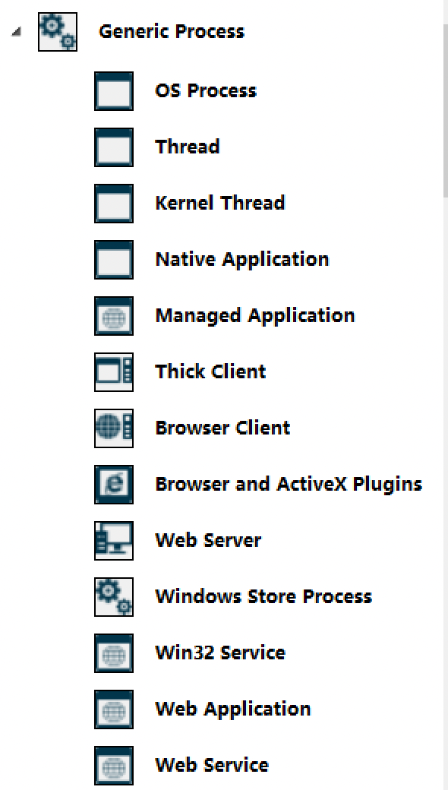

# 软件安全 第六次实验
*2019302120091 林韵祺 信息安全1班*
## 实验要求
- 调研威胁建模工具`Microsoft-Threat-Modeling-Tool`
- 撰写威胁建模工具使用报告
## 实验目的
- 了解互联网中系统运行所面临的安全风险；
- 了解系统应满足的基本信息安全需求以及安全设计原则；
- 了解威胁建模工具`Microsoft-Threat-Modeling-Tool`的使用方法及作用；
- 威胁建模的探索与实践

## 实验环境
- `VirtualBox` - `Windows10`
- `Thread Modeling Tool 2016`
## 实验内容
### 一、前期准备
- 下载安装
  - 下载地址：https://www.microsoft.com/en-us/download/confirmation.aspx?id=49168
  - 双击安装包，在弹出的框中点击“安装”
  - 等待下载，直到安装完成

### 二、工具调研
- **微软SDL( Security Development Lifecycle)流程**是一种专注于软件开发安全保障的流程，该套流程贯穿于软件系统的整个研发生命周期，为软件的安全可靠提供了保障。

- 为了让SDL流程在项目管理中更好的推进实施，微软发布了一套**威胁建模工具Threat Modeling Tool**，依靠该工具我们可以很方便的将软件研发的需求、设计、测试、部署等阶段与SDL流程协同推进。
> Microsoft威胁建模工具（Threat Modeling Tool）是一款基于STRIDE模型的威胁建模工具。通过该工具可以实现如下目的：
>- 分析与交流系统的安全设计方案
>- 使用经过证实的方法分析当前设计潜在的安全问题
>- 提出和管理针对安全问题的解决措施
- **STRIDE**是以下6种威胁类型的英文首字母缩写：
    - **Spoofing(假冒)**
    - **Tampering(篡改)**
    - **Repudiation(抵赖)**
    - **Information Disclosure（信息泄露）**
    - **Denial of Service（拒绝服务）**
- 可以将这6类威胁类型与5大信息安全特性以及软件安全设计原则进行映射</b>

- Threat Modeling通过 **数据流关系图(DFD)** 来构建威胁模型，通过构建DFD，可以理清系统中重要的被保护对象以及业务边界，在研发需求阶段同步开展安全需求的整理。

- Threat Modeling Tool自身提供了丰富的基础元件模板，以方便构建DFD，主要包含了**6种类型**：
    - **Generic Process（进程）**：OS Process、Threat、Web Server等</b>
    - **Generic External Interactor（外部实体）**：Browser、External Web Service、Megaservice等</b>
    - **Genetic Data Store（存储）**：SQL Database、File System、Cache等</b>
    - **Genetic Data Flow（数据流）**：HTTP、HTTPS、RPC or DCOM等</b>
    - **Genetic Trust Line Boundary（安全边界）**：Internet Boundary、Machine Trust Boundary等</b>
    - **Genetic Trust Border Boundary（安全区域）**：Internet Explorer Boundaries、Sandbox Trust Boundary Border等</b>
### 三、使用报告（模拟威胁建模过程）
- 威胁建模的全过程主要划分成4步，并且这4步将贯穿于SDL的安全流程管理之中：</b>
    - [构建模型图（Diagram）](#1构建模型图安全需求阶段)：安全需求阶段
    - [识别威胁（Identify）](#2识别威胁安全设计阶段)：安全设计阶段
    - [缓解问题（Mitigate）](#4缓解问题安全实施阶段)：安全实施阶段
    - [验证（Validate）](#5验证安全测试阶段)：安全测试阶段

##### 本实验以互联网金融平台一个最简单的业务场景来构建[威胁模型](exp6-demo.tm7)，基本的业务场景如下：
- 用户A通过浏览器操作互联网金融网站B进行抢标投资操作；
- 网站B创建完用户订单后，定向到网银C供用户进行相应的支付操作；
- 最终网银C将支付结果反馈给网站B，网站B确认支付，业务结束。

#### 1.构建模型图（安全需求阶段）
> 绘制数据流图就是用「外部实体」、「处理过程（进程）」、「数据存储」、「数据流」把系统（产品）的数据流转图画出来，这个工作需要开展威胁建模工作的人对产品有比较深入的了解。
</b>

#### 2.识别威胁（安全设计阶段）
##### 2.1 识别威胁列表
- 利用`Threat Modeling`工具根据上面的威胁模型数据流图可以自动生成相应的`Threat List`（威胁列表）
  - 选择`View` -> `Thread List`即可查看威胁列表</b>
- 这些威胁列表均由工具基于`STRIDE`威胁模型生成，安全人员要做的就是对这些威胁列表进行识别与分析，找到威胁的原因。

##### 2.2 威胁分析
> - 根据绘制的数据流图，按照元素与威胁对应表，分析所有元素可能遇到的威胁。这部分工作对威胁分析人员的安全能力要求很高，如果威胁分析不全，则风险就会被带到线上。而且威胁建模工作不仅仅是安全人员在架构评审时去做，更应该是产品经理在产品设计阶段需要完成，这就要求非安全人员要具备较高的安全能力。所以，企业一般需要借助威胁建模工具去辅助进行威胁分析。
> - 威胁建模工具需要具备两个库，一个是威胁分析阶段使用的「威胁库」，一个是制定消减措施阶段使用的「消减措施库」。
>   - 这里的「威胁库」可以分为两类，一类就是各种威胁，比如绕过认证、获取口令、破解口令等等；
>   - 还有一类是合规，各类法律法规的要求，比如隐私声明、企业内部要求等。
> - 当我们在数据流图上面选中某个元素进行威胁分析时，威胁建模工具可以自动的把这个元素可能涉及的威胁列出来，让分析人员去选择，并针对选择的威胁给出一定的消减措施提醒。
- 威胁分析具体步骤如下：
  1. 点击分析视图，进入威胁分析模式
  2. 逐个点击工具辨识出的威胁，判断该威胁是真实存在，还是误报，或者是已经有了缓解措施
  3. 对该威胁选择对应的状态填写

- 观察`Thread List`得知，`Threat Modeling`给出了几十条威胁告警,这些告警都是系统自动生的，但并非所有的威胁都是有效的、必要的，需要对这些告警进行安全分析确认，下面将挑选2条威胁进行分析。
- **威胁分析1**</b>
  - **威胁描述**：该威胁属于“篡改(Tampering)”类威胁。系统给出的解释是：由于网站B对于用户外部不受信任的输入未进行清理，所以网站B可能会被上传恶意脚本，进行CSS攻击。
  - **威胁成因**：按照默认不信任原则，任意来自外部的请求都是可能存在风险的，网站B在处理这些输入的时候，需要进行必要的安全性校验，从而降低受到类似于CSS（XSS）、SQL-Injection等外部非法输入攻击的可能。
  - **解决方案**：网站B在WebFilter层进行敏感字符的过滤与校验，同时在页面渲染的时候对页面数据进行转义（HtmlEncode），以避免CSS、XSS等脚本攻击。

- **威胁分析2**</b>
  - **威胁描述**：该威胁属于“欺诈(Spooling)”类型的威胁，系统给出的解释是：“网站B可能会被黑客欺诈，同时用户A传递的信息也有可能会遭到信息泄露，建议采用一个标准化的安全认证机制进行信息交互”。
  - **威胁成因**：经分析，因为系统采用的通信协议为HTTP，是不安全的，因为该协议传递的是明文信息，这可能遭受到中间人（Attacker）窃听或篡改，这样对于用户A而言，他的信息遭到了泄露；对于网站B而言，它遭到了欺骗。
  - **解决方案**：采用Https协议进行通信。
#### 3.威胁报告
- Threat Modeling会基于构建的威胁模型生成可能存在潜在风险的威胁列表，安全人员只需要对照这些列表进行依次分析，同时对相应的威胁状态与安全等级进行标记或者调整。
- 选择`Reports` -> `Create Full Report`,单击`Generate Report`即可生成威胁报告</b></b>
- 最终通过工具即可生成一份详细的[威胁报告](demo-report.htm)，下面截取部分报告内容：</b></b></b>

#### 4.缓解问题（安全实施阶段）
- 通过上述对威胁列表的分析与标记，最终得到了一份较为细致准确的威胁报告，接下来要做的就是与研发部门进行讨论，给出相应的安全修复建议，然后交由他们进行相应的安全开发设计。
#### 5.验证（安全测试阶段）
- 安全人员可以基于威胁建模报告，输出相应的安全测试用例，在研发提交功能测试的同时，安全人员也将介入开展安全测试，从而验证威胁漏洞是否被很好的堵上，最终保障系统的安全。

## 实验心得
- **威胁建模的本质**可以说是：通常我们无法证明给定的设计是安全的，但可以从既有的错误中汲取教训并避免犯同样的错误。
- 使用Threat Modeling Tool，可以将**DSL安全流程**很好的引入到项目管理中，这对软件研发全流程安全的把控起到了积极的作用。

- 通过威胁建模，安全人员可以有效的分析出系统**可能存在的安全漏洞**，及早的给出研发人员安全修复建议，同时还可以**指导自身安全测试工作的开展**，对研发安全的效率与效果都具有良好的提升。

- 安全不是一蹴而就的，`Threat Modeling Tool`提供的只是对**已知威胁的分析**，它可以帮助我们避免犯同样的错误，同时还有更多未知的威胁等待着我们去挖掘与探索。

## 参考资料
- [威胁建模工具功能概述](https://docs.microsoft.com/zh-cn/azure/security/develop/threat-modeling-tool-feature-overview)
- [威胁建模工具入门](https://docs.microsoft.com/zh-cn/azure/security/develop/threat-modeling-tool-getting-started)
- [Microsoft-Threat-Modeling-Tool威胁建模工具介绍](https://blog.csdn.net/wutianxu123/article/details/108538465?ops_request_misc=%257B%2522request%255Fid%2522%253A%2522164022830816780366582013%2522%252C%2522scm%2522%253A%252220140713.130102334.pc%255Fblog.%2522%257D&request_id=164022830816780366582013&biz_id=0&utm_medium=distribute.pc_search_result.none-task-blog-2~blog~first_rank_ecpm_v1~rank_v31_ecpm-20-108538465.nonecase&utm_term=%E5%A8%81%E8%83%81%E5%BB%BA%E6%A8%A1&spm=1018.2226.3001.4450)
- [Microsoft SDL-威胁建模工具Threat Modeling Tool](https://blog.csdn.net/qq_29277155/article/details/89949026?ops_request_misc=%257B%2522request%255Fid%2522%253A%2522164032590316780271930714%2522%252C%2522scm%2522%253A%252220140713.130102334.pc%255Fblog.%2522%257D&request_id=164032590316780271930714&biz_id=0&utm_medium=distribute.pc_search_result.none-task-blog-2~blog~first_rank_ecpm_v1~rank_v31_ecpm-1-89949026.nonecase&utm_term=SDL+Thread+modeling&spm=1018.2226.3001.4450)
